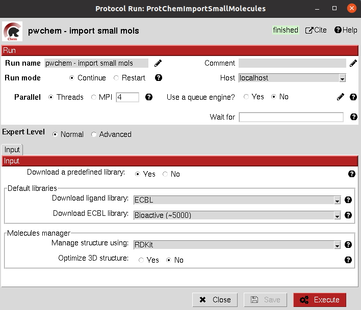
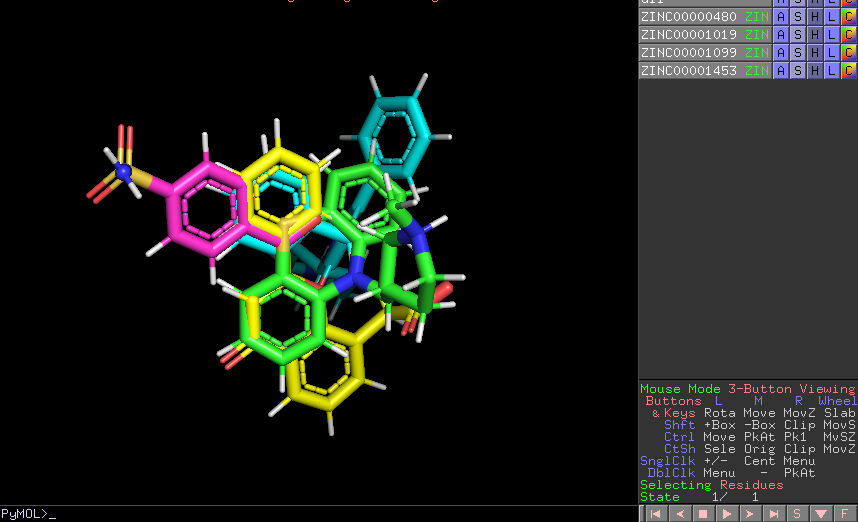

:orphan: true
.. _pwchem-import-small-molecules:

###############################################################
Import Small Molecules
###############################################################
This protocol imports a set of small molecules from one or several files or from default database libraries like 
`ECBL <https://www.eu-openscreen.eu/services/compound-collection/european-chemical-biology-library-ecbl-diversity-library.html>`_ 
or `ZINC <https://zinc.docking.org/>`_.

Input
----------------------------------------
.. include:: ../../../../templates/plugins/input-help.rst

.. image:: ../../../../../_static/images/plugins/pwchem/virtual-drug-screening/import-small-molecules/form_1.png
   :alt: Import Small Molecules form 1
   :height: 400
   :align: center

|

|

The result of this protocol is a ``SetOfSmallMolecules``, in 2D or 3D conformations depending on the source and whether
the user specified 3D optimization.

|

.. |testCommand| replace:: pwchem.tests.tests_imports.TestImportSmallMolecules
.. include:: ../../../../templates/plugins/protocol-test.rst
