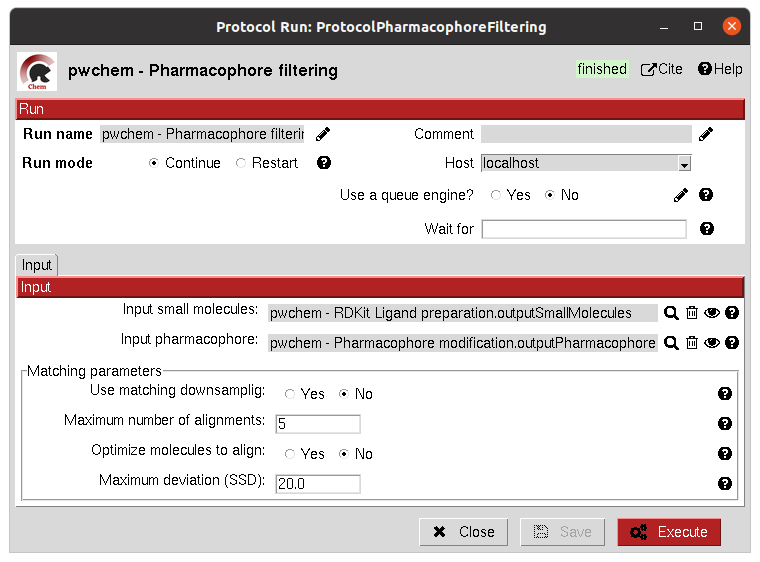
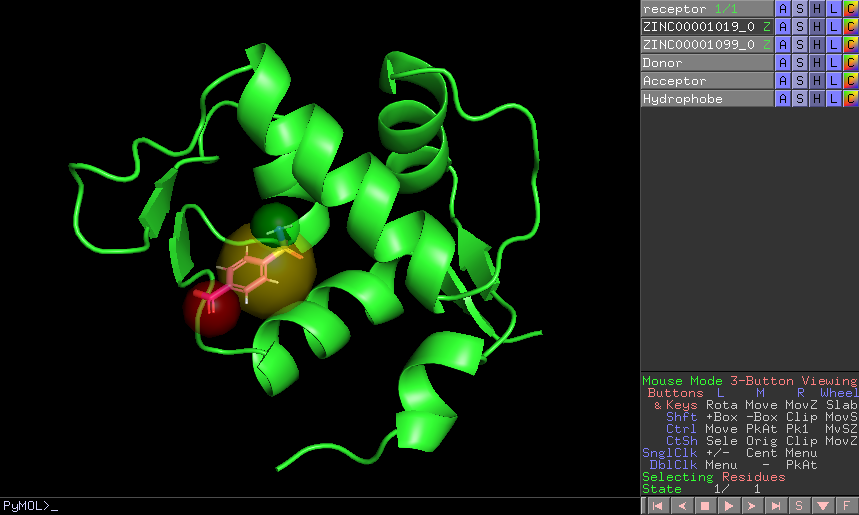

:orphan: true
.. _pwchem-pharmacophore-filtering:

###############################################################
Pharmacophore filtering
###############################################################
This protocol uses `RDKit <https://github.com/rdkit/rdkit>`_ for filtering a ``SetOfSmallMolecules`` by matching them with a ``Pharmacophore``.
For each molecule to pass, its own features must match those of the pharmacophore with a certain maximum deviation.
Several different molecule-pharmacophore alignments can be tried to match them.

Input
----------------------------------------
.. include:: ../../../../templates/plugins/input-help.rst

|

The result of this protocol is a ``SetOfSmallMolecules`` containing only those small molecules that match the ``Pharmacophore``.
In case the ``Pharmacophore`` included a receptor structure, the output molecules will be docked to it.
In ``Analyze results``, the user can visualize how the molecules and the pharmacophore match.

|

.. |testCommand| replace:: pwchem.tests.tests_pharmacophores.TestPharmFiltering
.. include:: ../../../../templates/plugins/protocol-test.rst