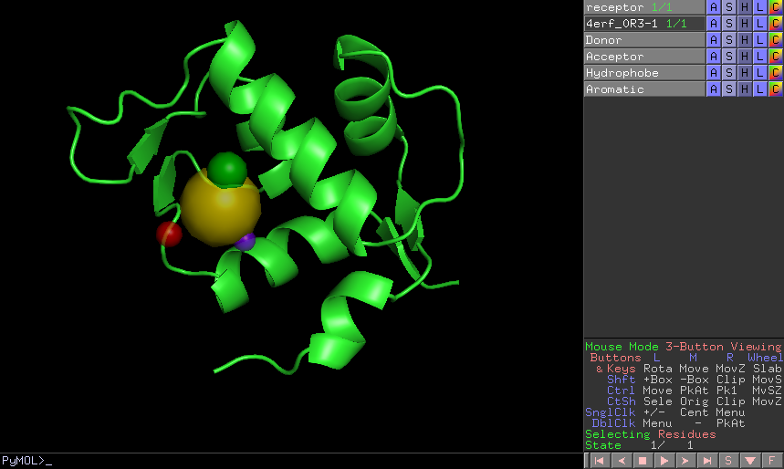

.. _docs-pharmacophore-generation:

###############################################################
Pharmacophore generation
###############################################################
This protocol generate a ``Pharmacophore`` object that can be parse by `RDKit <https://github.com/rdkit/rdkit>`_ from a 
``SetOfSmallMolecules``. If the input molecules are docked to a structure, the output pharmacophore keeps that structure 
too. The different features that can be captured by the pharmacophore are defined in the ``BaseFeatures.def`` file of RDKit. 
scipion-chem uses the families of those features as own features (Donor, Acceptor, Hydrophobe, Aromatic...).

Different cluster parameters can be chosen to generate the pharmacophore, they control the clustering method and how
conserved the feature must be among the docked small molecules.

Input
----------------------------------------
.. include:: ../../../../templates/plugins/input-help.rst

.. image:: ../../../../../_static/images/plugins/pwchem/virtual-drug-screening/pharmacophore-generation/form_1.png
   :alt: Pharmacophore generation form 1
   :height: 400
   :align: center

|

.. image:: ../../../../../_static/images/plugins/pwchem/virtual-drug-screening/pharmacophore-generation/form_2.png
   :alt: Pharmacophore generation form 2
   :height: 400
   :align: center

|

The result of this protocol is a ``PharmacophoreChem`` object containing the extracted features from the set of small molecules
with the specified clustering parameters.

|

.. |testCommand| replace:: pwchem.tests.tests_pharmacophores.TestPharmGeneration
.. include:: ../../../../templates/plugins/protocol-test.rst