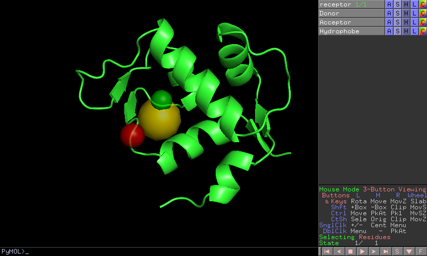

:orphan: true

.. _pwchem-pharmacophore-modification:

###############################################################
Pharmacophore modification
###############################################################
This protocol modifies the properties of the features inside a ``Pharmacophore`` object. The user can design a list of
actions involving removal or modification of present features or the addition of new ones. The user can specify the
coordinates, size and type  of each of the modified features.

Input
----------------------------------------
.. include:: ../../../../templates/plugins/input-help.rst

.. image:: ../../../../../_static/images/plugins/pwchem/virtual-drug-screening/pharmacophore-modification/form.png
   :alt: Pharmacophore modification form
   :height: 400
   :align: center

|

The result of this protocol is a ``PharmacophoreChem`` object with the modified features.

|

.. |testCommand| replace:: pwchem.tests.tests_pharmacophores.TestPharmModification
.. include:: ../../../../templates/plugins/protocol-test.rst