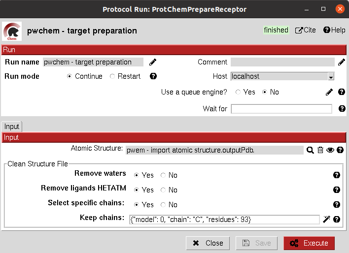
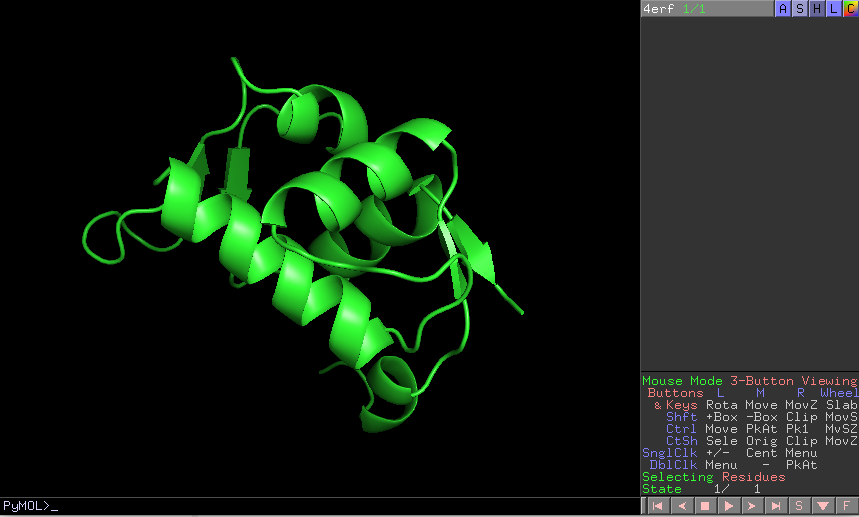

.. _docs-prepare-receptor:

###############################################################
Prepare Receptor
###############################################################
This protocol provides a simple ``AtomStruct`` preparation with `BioPython <https://biopython.org/>`_ where the user can choose different cleaning
options like removing waters, heteroatoms, keep only specific chains... Its functionality is included in several other
protocols that manage ``AtomStruct`` objects.

Input
----------------------------------------
.. include:: ../../../../templates/plugins/input-help.rst

|

The result of this protocol is an ``AtomStruct`` cleaned with the form specifications.

|

.. |testCommand| replace:: pwchem.tests.tests_preparations.TestPrepareReceptor
.. include:: ../../../../templates/plugins/protocol-test.rst