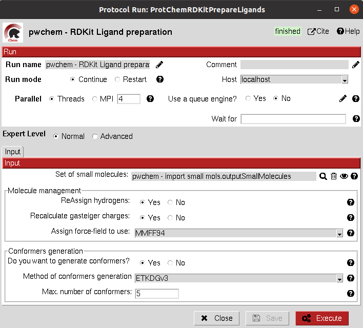
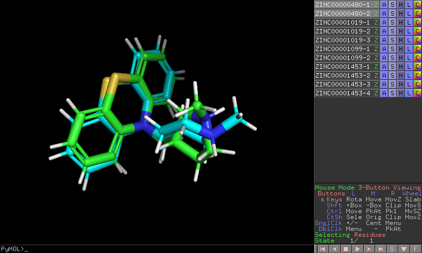

.. _docs-rdkit-prepare-small-molecules:

###############################################################
RDKit Prepare Small Molecules
###############################################################
This protocol prepares a ``SetOfSmallMolecules`` using `RDKit <https://github.com/rdkit/rdkit>`_. 
The user can choose several methods for the charge assignment and conformer generation.

Input
----------------------------------------
.. include:: ../../../../templates/plugins/input-help.rst

|

The result of this protocol is a ``SetOfSmallMolecules`` prepared by RDKit. 
If the option for generating conformers was chosen, different conformations for each input molecule will be accessible.

|

.. |testCommand| replace:: pwchem.tests.tests_preparations.TestRDKitLigandPreparation
.. include:: ../../../../templates/plugins/protocol-test.rst