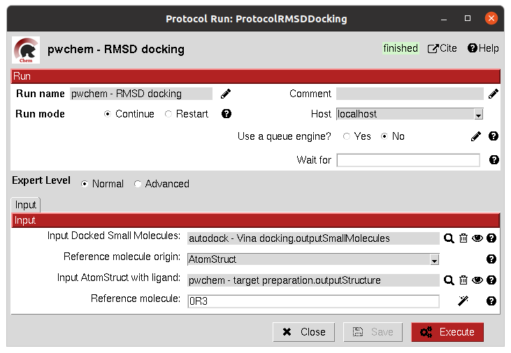
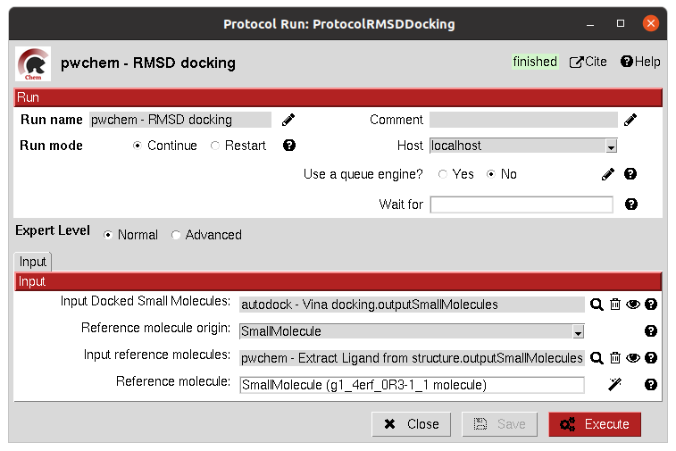

.. _pwchem-rmsd-docking:

###############################################################
RMSD docking
###############################################################
This protocol allows the user to calculate the RMSD between a ``SetOfSmallMolecules`` to a reference molecule docked to the
same receptor. The reference molecule can come either from a ``AtomStruct`` or a ``SetOfSmallMolecules``.

Input
----------------------------------------
.. include:: ../../../../templates/plugins/input-help.rst

|

|

The result of this protocol is a ``SetOfSmallMolecules`` with the calculated RMSD to the reference molecule.

.. |testCommand| replace:: pwchem.tests.tests_docking.TestRMSDDocking
.. include:: ../../../../templates/plugins/protocol-test.rst