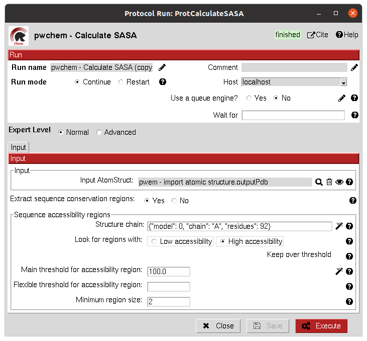
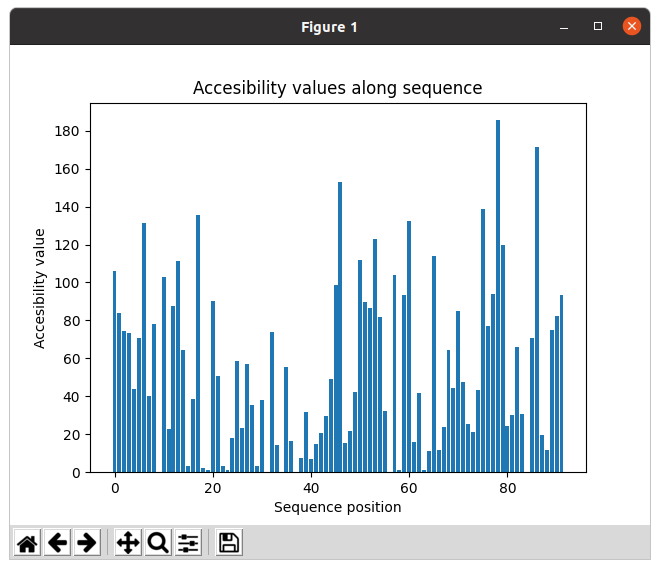
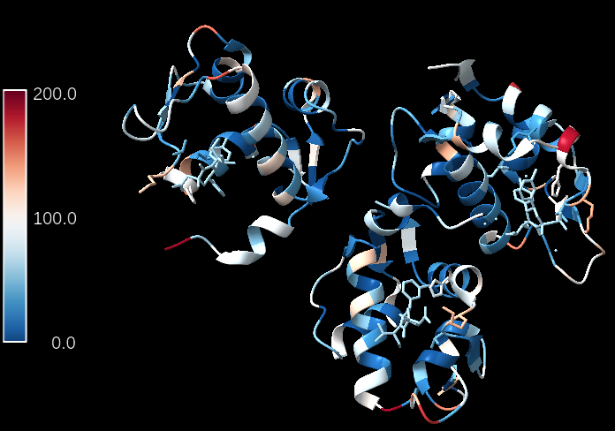
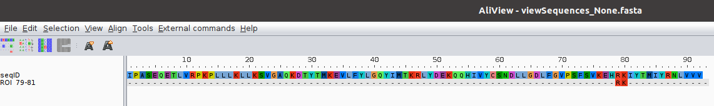

.. _docs-sasa-calculation:

###############################################################
SASA calculation
###############################################################
This protocol uses `BioPython <https://biopython.org/>`_ to calculate the `SASA <https://en.wikipedia.org/wiki/Accessible_surface_area>`_
(Solvent-Accessible Surface Area) for each residue in an ``AtomStruct``.

Input
----------------------------------------
.. include:: ../../../../templates/plugins/input-help.rst

|

|

The result of this protocol is an ``AtomStruct`` containing the SASA value for each reside of the receptor, which can be
visualized in the Analyzed results window.

|

Additionally, the protocol can also output a ``SetOfSequenceROIs`` with those residues with SASA values higher/lower than a
threshold. The user can preview the SASA values in the protocol to define the threshold.

|

.. |testCommand| replace:: pwchem.tests.tests_attributes.TestCalculateSASA
.. include:: ../../../../templates/plugins/protocol-test.rst