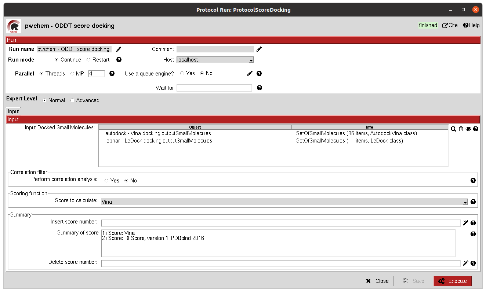

.. _pwchem-score-docking-positions:

###############################################################
Score docking positions
###############################################################
This protocol allows the user to rescore a ``SetOfSmallMolecules`` docked to a receptor using several
`ODDT <https://github.com/oddt/oddt>`_ scoring functions. The user may even use several of these functions together
and average them, checking first if they correlate.

Input
----------------------------------------
.. include:: ../../../../templates/plugins/input-help.rst

|

The result of this protocol is a ``SetOfSmallMolecules`` with the calculated ODDT score.

.. |testCommand| replace:: pwchem.tests.tests_docking.TestScoreDocking
.. include:: ../../../../templates/plugins/protocol-test.rst