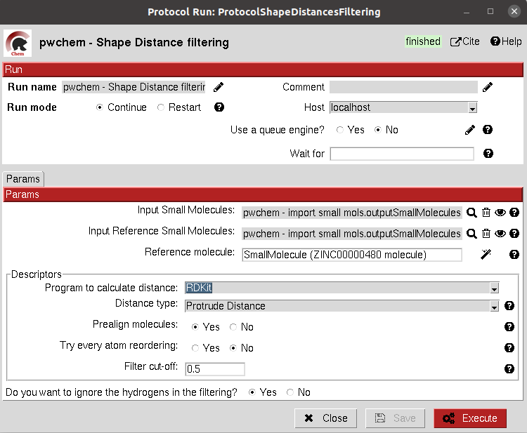

.. _docs-shape-small-molecules-filter:

###############################################################
Shape Small Molecules filter
###############################################################
This protocol uses `RDKIT <https://github.com/rdkit/rdkit>`_ to filter a ``SetOfSmallMolecules`` 
by applying shape filters to each of the small molecules stored. 
The user can choose whether to use RDKit or `Shape-it <https://github.com/rdkit/shape-it>`_ to calculate the molecules shape and different shape 
distance options like `Tanimoto <https://en.wikipedia.org/wiki/Jaccard_index#Tanimoto_similarity_and_distance>`_
, Protrude or `RMSD <https://en.wikipedia.org/wiki/Root-mean-square_deviation_of_atomic_positions>`_ distances.

Other parameters include the prealignment of the molecules or to trying atom reordering in order to improve the filter
performance.

.. note::
   Currently, `Shape-it <https://github.com/rdkit/shape-it>`_ is not automatically installed with scipion-chem.
   If the user wants to use it, they must install it manually and define its path in the scipion.conf file as ``SHAPEIT_HOME``.

Input
----------------------------------------
.. include:: ../../../../templates/plugins/input-help.rst

|

The result of this protocol is a ``SetOfSmallMolecules`` containing only those small molecules that pass the filter.

.. |testCommand| replace:: pwchem.tests.tests_ligand_filtering.TestShapeFiltering
.. include:: ../../../../templates/plugins/protocol-test.rst