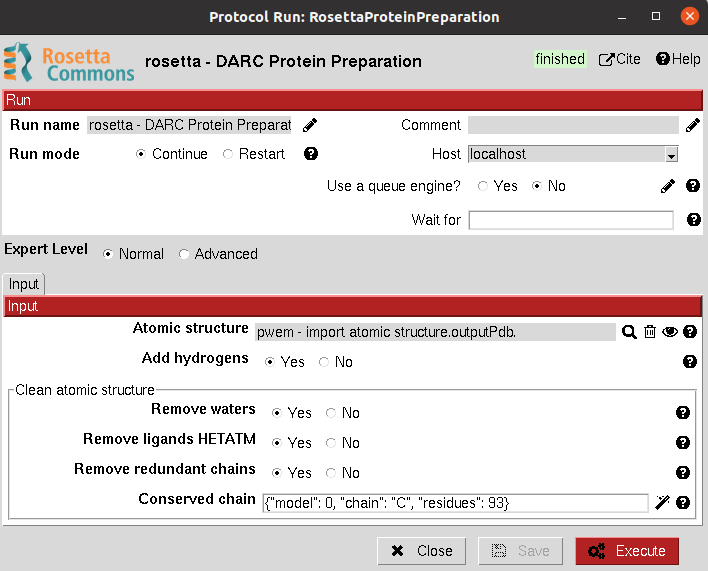
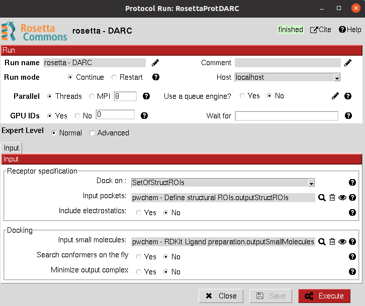
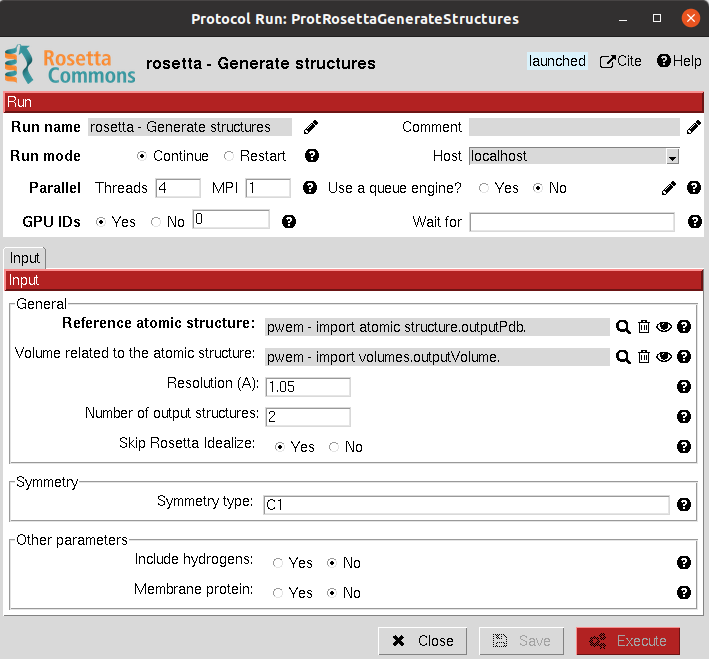

.. _docs-chem-rosetta:

.. figure:: ../../../_static/images/rosetta/rosetta_logo.png
   :alt: rosetta logo

###############################################################
scipion-chem-rosetta
###############################################################
In order to use this plugin, you need to install first Scipion-chem.
`Scipion-chem <https://github.com/scipion-chem/docs>`_
is the core for the rest of scipion-chem-\* plugins. To do so, you can check the instructions in the
`Scipion-chem README <https://github.com/scipion-chem/scipion-chem/blob/master/README.rst>`_.

Similarly, you can find the installation instructions of this plugin in
`Scipion-chem-rosetta README <https://github.com/scipion-chem/scipion-chem-rosetta/blob/master/README.rst>`_

|

Scipion-chem-rosetta overview
******************************************
`Rosetta <https://www.rosettacommons.org/software/>`_ includes algorithms for computational modeling and analysis of
protein structures. It has enabled notable scientific advances in computational biology, including de novo protein
design, enzyme design, ligand docking, and structure prediction of biological macromolecules and macromolecular
complexes.

From Scipion-chem, we have mainly integrated protocols for the preparation of the protein receptors and the docking
process, using `DARC <https://pubmed.ncbi.nlm.nih.gov/26181386/>`_.

Scipion-chem-rosetta protocols
******************************************

**Receptor preparation**
================================
This protocol prepares an AtomStruct object containing a protein file for docking. It mainly adds the hydrogens and
missing atoms.

From Scipion-chem, we also provide the option of cleaning the structure from HETATM atoms and selecting specific
chains from the input structure.

All parameters include a help button that gives further information for each of them.

|

|

The result of this protocol is an AtomStruct object containing the resulting pdb file of the receptor, ready for
other VDS tools.

A test for this protocol can be run using::
    scipion3 tests rosetta.tests.test_target_preparation.TestTargetPreparation

|

**Docking**
================================
In Scipion-chem-rosetta, we offer a protocol for `DARC <https://pubmed.ncbi.nlm.nih.gov/26181386/>`_ docking.
It can take as input either an AtomStruct (where you would need to define the residue(s) where the docking will be
performed around) or a SetOfStructROIs (to directly define the region as a Structural Regions Of Interest).

By default, DARC works only matching the shape of the ligand and receptor, but the user can input a electrostatic
grid built by AutoDock to take into account also electrostatics, which might substantially increase the performance.

 |form2_1|

|

|

The results of these protocols are a SetOfSmallMolecules, containing the predicted binding poses for the input
molecules. The user can visualize them using **Analyze Results**, which will display the General SmallMolecules viewer.
Using this viewer you can also visualize the rays that define the "pockets" where the molecules are docked.

Tests for these protocols can be run using::
    scipion3 tests rosetta.tests.test_darc.TestDARC

|

**Electronic map modelling**
================================
In Scipion-chem-rosetta, we offer a protocol for generating a set of possible atomic structures which fit an electronic
density map. The protocol has been integrated as the first step for a
`global and local Cryo-EM map quality assessment <https://www.sciencedirect.com/science/article/pii/S0969212618303642?via%3Dihub>`_.

The inputs of the protocol are both the volume where the resolution will be estimated and a reference atomic structure.
The user can specify whether to consider symmetry and distinct other parameters for Rosetta. For more details about
the method you can read `this article <https://elifesciences.org/articles/17219>`_.

 |form3_1|

|

|

The results of these protocols are a SetOfAtomStructs, containing all the atomic structures generated by the protocol
matching the reference density map.

Tests for these protocols can be run using::
    scipion3 tests rosetta.tests.test_generate_structures.TestGenerateStructures

The user must be aware that this protocol is quite expensive, computationally speaking, and will need a considerable
amount of time to be run, including the test (even just generating 2 atomic models).

|

Get in contact
******************************************

From the Scipion team we would be happy to hear your doubts and suggestions, do not hesitate to contact us at any
time. To do so, you can either open an issue in the Github repository related to your question or
contact us by mail.

If the question is related to the Scipion framework, try the `contact us <https://scipion.i2pc.es/contact>`_ page.
If it is related to some Scipion-chem plugin or functionality, you can send a mail to
the developer at ddelhoyo@cnb.csic.es

