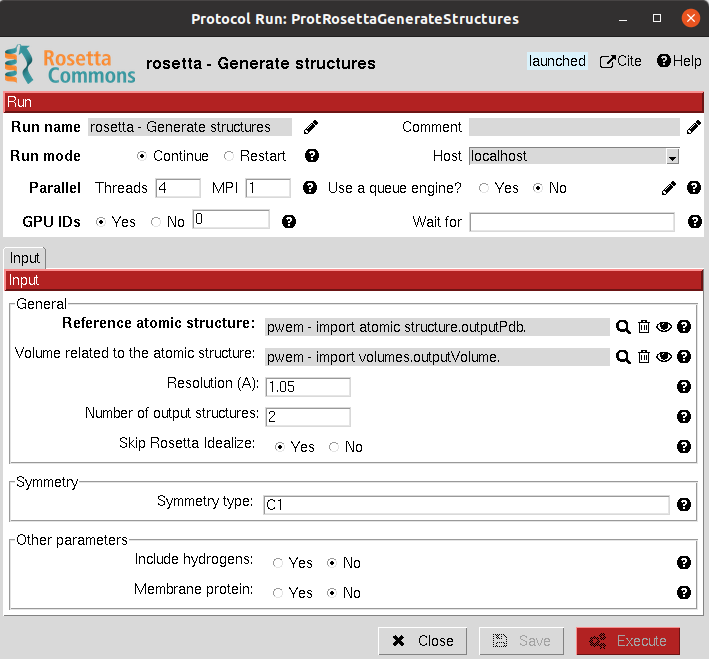

:orphan: true

.. _rosetta-Electronic_Map_Modelling:

###############################################################
Electronic Map Modelling
###############################################################
This protocol generates a set of possible atomic structures which fit an electronic density map. The protocol has been integrated as the first step for a `global and local Cryo-EM map quality assessment <https://www.sciencedirect.com/science/article/pii/S0969212618303642?via%3Dihub>`_.

The inputs of the protocol are both the volume where the resolution will be estimated and a reference atomic structure.
The user can specify whether to consider symmetry and distinct other parameters for Rosetta. For more details about the method you can read `this article <https://elifesciences.org/articles/17219>`_.

The user must be aware that this protocol is quite expensive, computationally speaking, and will need a considerable amount of time to be run, including the test (even just generating 2 atomic models).

|

|

The results of these protocols are a ``SetOfAtomStructs``, containing all the atomic structures generated by the protocol
matching the reference density map.

|

.. |testCommand| replace:: rosetta.tests.test_generate_structures.TestGenerateStructures
.. include:: ../../../templates/plugins/protocol-test.rst

| 
