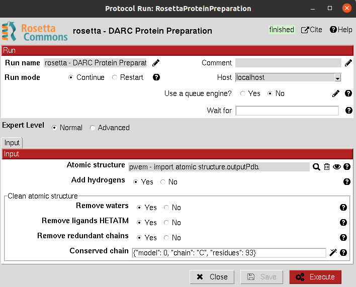

:orphan: true

.. _rosetta-Receptor_Preparation:

###############################################################
Rosetta Receptor Preparation
###############################################################
This protocol prepares an ``AtomStruct`` object containing a protein file for docking. It mainly adds the hydrogens and
missing atoms.

From Scipion-chem, we also provide the option of cleaning the structure from HETATM atoms and selecting specific
chains from the input structure.

|

|

The result of this protocol is an ``AtomStruct`` object containing the resulting pdb file of the receptor, ready to be used in other tools.

|

.. |testCommand| replace:: rosetta.tests.test_rosetta.TestrosettaPrepareReceptor
.. include:: ../../../templates/plugins/protocol-test.rst

| 
