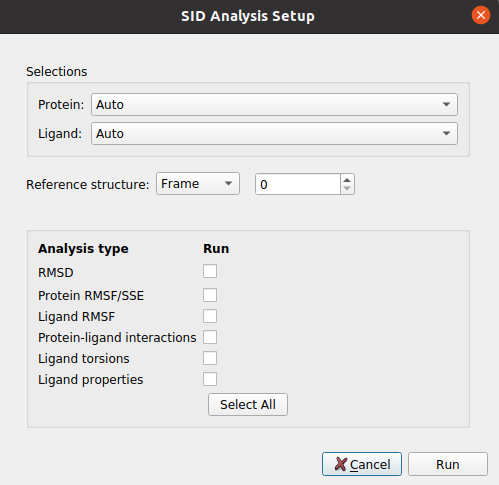

:orphan: true

.. _schrodinger-Desmond_MD_Simulation:

###############################################################
Schrödinger MD Simulation (Desmond)
###############################################################
This protocol takes the prepared Schrodinger system and uses `Desmond <https://www.schrodinger.com/products/desmond>`_ to run a defined simulation. 
In the form, the user can define different simulation stages that the protocol will run sequentially. The parameters of this protocol are grouped as:

1) **Input**: The ``SchrodingerSystem`` product of the system preparation described above.

Then, the user can define the different MD stages:

2) **Simulation time**: Defines the length of the simulation in number of steps for the minimization and in time for NVT and NPT. In the case of NVT and NPT, the user can also specify whether the trajectory from the stage should be saved.

3) **Trajectory**: Defines the trajectory parameters and whether it should be saved.

4) **Ensemble**: Defines the type of simulation in the current stage. The user can choose from energy minimization, NVE, NVT, NPT... Then, for each of them other parameters will appear to further tune the simulation.

5) **Restraints**: Energetic restraints can be defined during the stage for the principal groups of atoms present in the system (Ligand, Protein, Solute, Heavy atoms...)

Then, the defined stage can be inserted into the workflow, whose summary is shown below.

5) **Summary**: A summary of the added stages is shown. However, this list is just a summary and manual modifications will not yield changes. In order to modify the stages, the user need to use the wizards in order to add, delete or watch the parameters of the desired stages, which can be specified in the wizard text input.

The user can also choose from a set of default workflows that will automatically be added to the summary when its wizard is used. Currently, only the default "NPT desmond relaxation" is included, which carries out a typical system relaxation.

|

|

The result of this protocol is a SchrodingerSystem, this time also containing the concatenated trajectory of the last saved stages (If stages 2, 4 and 5 were saved, since we should not concatenate 2 to 4, only 4 and 5 will be saved).
Using **Analyze Results**, a form with different visualization options will be displayed, where the user can:

|

.. figure:: ../../../../../_static/images/plugins/schrodinger/schrodinger_out7_1.png
   :alt: schrodinger out7_1

|

1) **Open MD simulation**: Inspect the system trajectories of the different stages saved using Maestro.

|

.. figure:: ../../../../../_static/images/plugins/schrodinger/schrodinger_out7_2.png
   :alt: schrodinger out7_2

|

2) **Schrodinger Event Analysis**: Perform different analysis of the trajectories using Desmond. 
The user can choose whether to perform the complete set of analysis or a custom subset. Among these analysis it includes the variation of RMSD, RMSF, Gyration... of the different atom groups through the trajectory.

|

|out7_3| |out7_4|

.. |out7_4| image:: ../../../../../_static/images/plugins/schrodinger/schrodinger_out7_4.png
   :alt: schrodinger out7_4
   :height: 470

|

.. |testCommand| replace:: schrodingerScipion.tests.md_wf.TestDesmondMD
.. include:: ../../../../templates/plugins/protocol-test.rst

| 
