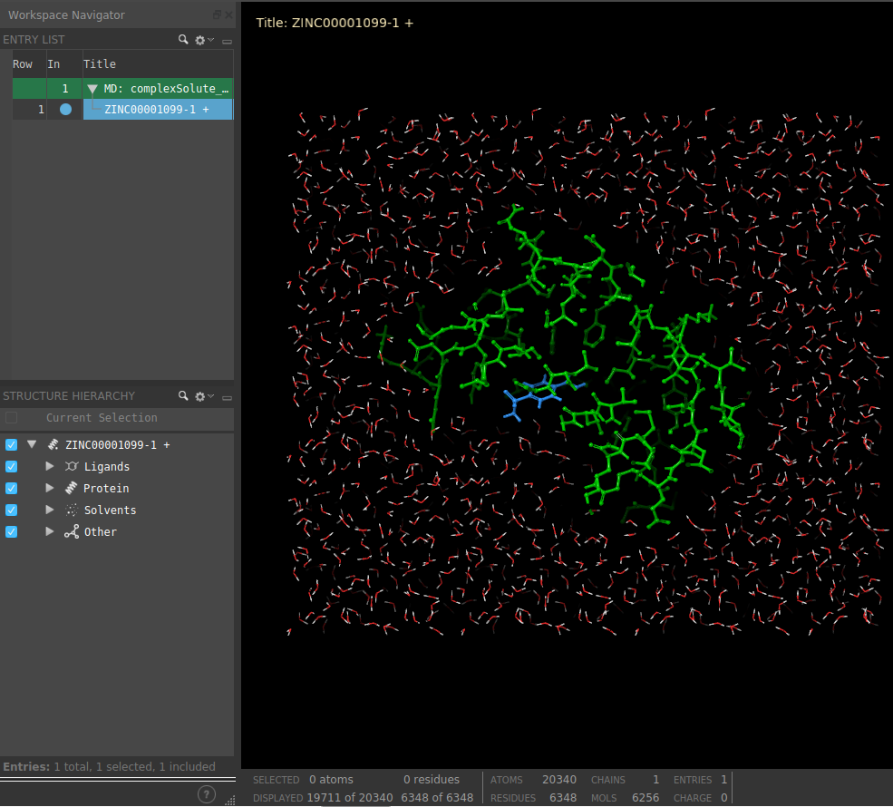

:orphan: true

.. _schrodinger-system-preparation:

###############################################################
Schrödinger System Preparation (Desmond)
###############################################################
This protocol prepares a Schrodinger MD system using `Desmond <https://www.schrodinger.com/products/desmond>`_ prior to its simulation from a ``AtomStruct`` or a ``SmallMolecule`` object.
We recommend you to input the protein or ligand structures from a previous Schrodinger protocol. If the structure comes from another plugin or a raw pdb, conversions will be attempted to adapt them to the Schrodinger format.

This protocol allows the user to create a solute boundary box, define the force field and finally specify the ions in the solute, which can be set to neutralize the charges, or manually add the desired number.

This protocol also includes the functionality for preparing complexes containing non-protein atoms, such as ligands, as Schrodinger takes care of the ligand parametrization itself.

Input
----------------------------------------
.. include:: ../../../../templates/plugins/input-help.rst

.. image:: ../../../../../_static/images/plugins/schrodinger/molecular-dynamics/system-preparation/form_1.png
   :alt: Schrödinger System Preparation form 1
   :height: 400
   :align: center

|

.. image:: ../../../../../_static/images/plugins/schrodinger/molecular-dynamics/system-preparation/form_2.png
   :alt: Schrödinger System Preparation form 2
   :height: 400
   :align: center

|

The result of this protocol is a ``SchrodingerSystem``, containing the Schrodinger structural files.

The user can visualize the complex with Maestro using **Analyze Results**.

.. image:: ../../../../../_static/images/plugins/schrodinger/molecular-dynamics/system-preparation/output_1.png
   :alt: Schrödinger System Preparation output 1
   :align: center

|

|

.. |testCommand| replace:: schrodingerScipion.tests.md_wf.TestDesmondSysPrep
.. include:: ../../../../templates/plugins/protocol-test.rst
