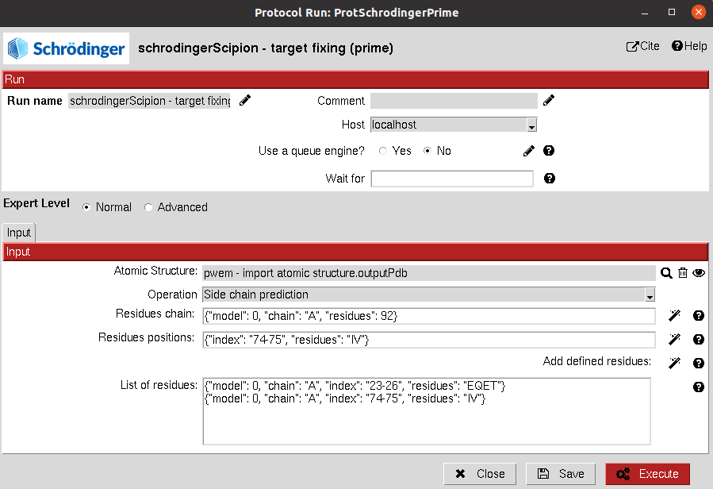

:orphan: true

.. _schrodinger-fix-structure:

###############################################################
Schrödinger Fix Structure
###############################################################
This protocol allows the user to use `Prime <https://www.schrodinger.com/products/prime>`_ for fixing an atomic structure.

The user can choose to minimize the hydrogens in the structure, predict and redefine a loop structure or to 
predict and redefine the side chains of a set of residues. Wizards can be used to define the residues involved in the two former options.

Input
----------------------------------------
.. include:: ../../../../templates/plugins/input-help.rst

|

The result of this protocol is an ``AtomStruct`` containing the fixed structure file in Maestro format.

.. |testCommand| replace:: schrodingerScipion.tests.test_utils.TestPrimeSchro
.. include:: ../../../../templates/plugins/protocol-test.rst
