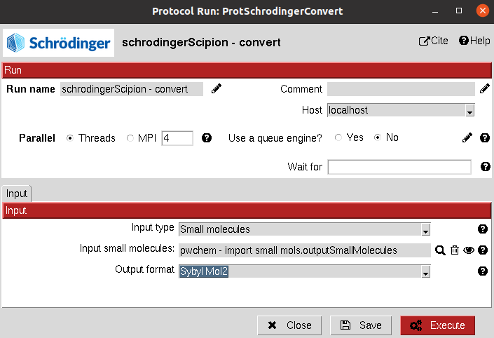

:orphan: true

.. _schrodinger-Format_Conversion:

###############################################################
Schrödinger Format Conversion
###############################################################
This protocol uses Schrodinger scripts to convert an ``AtomStruct`` or a ``SetOfSmallMolecules`` to the desired format.
This protocol should not be necessary for Scipion-chem workflows since all conversions are handled internally, but it might be used to generate some files that will be used externally.

|

|

The result of this protocol is either an ``AtomStruct`` or a ``SetOfSmallMolecules``, containing converted files in the desired format. 
The user can access those files in the protocols folder (using "Browse" / folder icon).

| 

.. |testCommand| replace:: schrodingerScipion.tests.test_utils.TestSchroConvert
.. include:: ../../../templates/plugins/protocol-test.rst

| 
