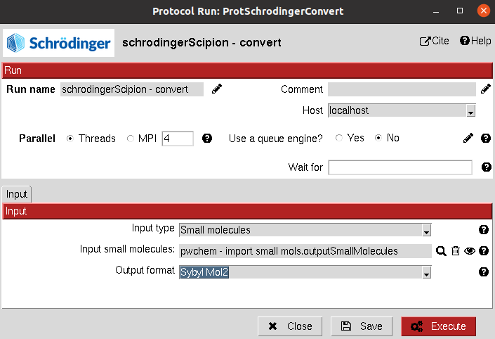

:orphan: true

.. _schrodinger-format-conversion:

###############################################################
Schrödinger Format Conversion
###############################################################
This protocol uses Schrodinger scripts to convert an ``AtomStruct`` or a ``SetOfSmallMolecules`` to the desired format.

.. note::
   This protocol should not be necessary for Scipion Chem workflows since all conversions are handled internally, 
   but it might be used to generate some files that will be used externally.

Input
----------------------------------------
.. include:: ../../../../templates/plugins/input-help.rst

|

The result of this protocol is either an ``AtomStruct`` or a ``SetOfSmallMolecules``, containing converted files in the desired format.

The user can access those files in the protocols folder (using "Browse" / folder icon).

.. |testCommand| replace:: pwchemSchrodinger.tests.test_utils.TestSchroConvert
.. include:: ../../../../templates/plugins/protocol-test.rst
