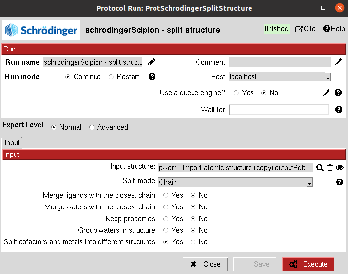

:orphan: true

.. _schrodinger-Split_Structure:

###############################################################
Schrödinger Split Structure
###############################################################
This protocol allows the user to use the *split_structure.py* script from Schrodinger mmShare. 
It can be used to split proteins, ligands or different chains inside the structure.

|

|

The result of this protocol is an ``AtomStruct`` containing the splitted structure file in Maestro format.

| 

.. |testCommand| replace:: schrodingerScipion.tests.test_utils.TestSplitSchro
.. include:: ../../../templates/plugins/protocol-test.rst

| 
