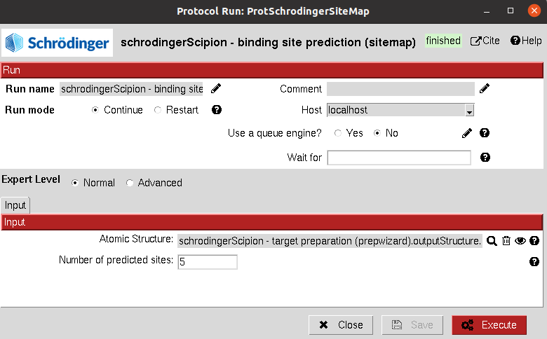

:orphan: true

.. _schrodinger-Binding_Site_Prediction:

###############################################################
Schrödinger Binding Site Prediction (SiteMap)
###############################################################
This protocol predicts the most promising binding sites on the structure using `SiteMap <https://www.schrodinger.com/products/sitemap>`_ .

|

|

The result of this protocol is a ``SetOfStructROIs`` (Structural Regions Of Interest), containing the predicted binding sites. 
The user can visualize them using **Analyze Results**, which will display the General StructROIs viewer.

| 

.. |testCommand| replace:: schrodingerScipion.tests.main_wf.TestSitemap
.. include:: ../../../../templates/plugins/protocol-test.rst

| 
