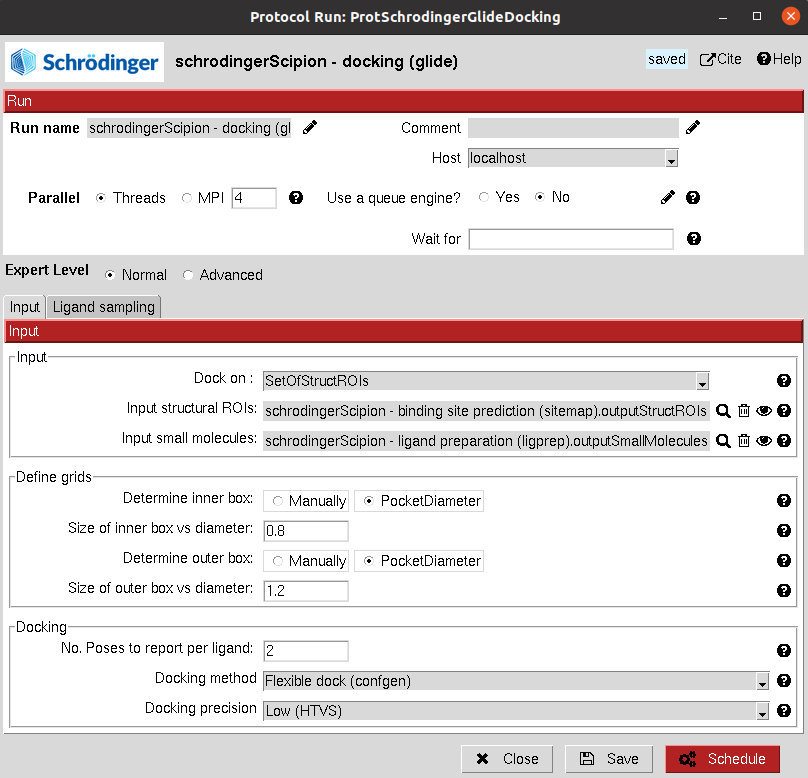

:orphan: true

.. _schrodinger-glide-docking:

###############################################################
Schrödinger Glide Docking
###############################################################
This protocol uses `Glide <https://www.schrodinger.com/products/glide>`_ for docking a set of ligands to a receptor.
The docking can be performed on the whole protein structure or on specific sites, which can be defines as a 
``SetOfStructROIs`` or as a ``SetOfSchrodingerGrids``.

Input
----------------------------------------
.. include:: ../../../../templates/plugins/input-help.rst

|

.. image:: ../../../../../_static/images/plugins/schrodinger/virtual-drug-screening/glide-docking/form_2.png
   :alt: Schrödinger Glide Docking form 2
   :height: 400
   :align: center

|

The results of these protocols are a ``SetOfSmallMolecules``, containing the predicted binding poses for the input molecules.

The user can visualize them using **Analyze Results**, which will display the General SmallMolecules viewer.

.. |testCommand| replace:: schrodingerScipion.tests.main_wf.TestGlideDocking
.. include:: ../../../../templates/plugins/protocol-test.rst
