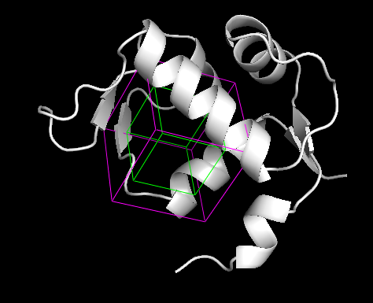

:orphan: true

.. _schrodinger-Grid_Preparation:

###############################################################
Grid Preparation
###############################################################
This protocol generates the grids used by the docking Schrodinger program: `Glide <https://www.schrodinger.com/products/glide>`_. 
The protocol is currently deprecated since all the necessary grids are internally generated by the glide docking protocol described below.
It might just be useful to generate and then check the resulting grids.

An additional option is included to manually define the Grids from Schrodinger's GUI.

|

|

The result of this protocol is a SetOfSchrodingerGrids, around the specified site. Each grid is conformed by an inner grid, where the center of mass of the ligand must be docked; and an outer grid, which must contains all the atoms of the ligand. 
The user can visualize these grids using **Analyze Results**.

| 

.. |testCommand| replace:: schrodingerScipion.tests.main_wf.TestGridSchro
.. include:: ../../../templates/plugins/protocol-test.rst

| 
