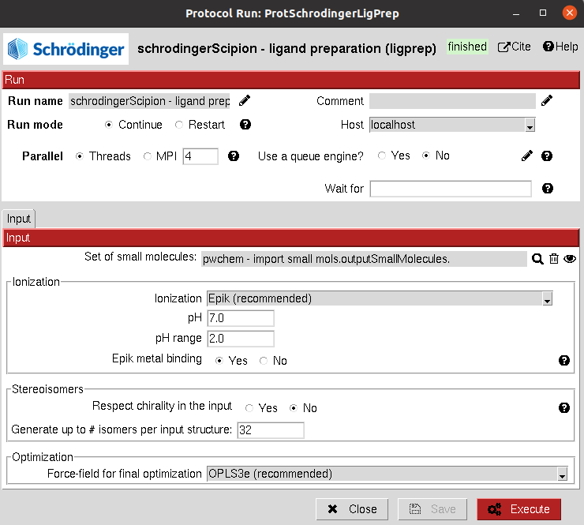

:orphan: true

.. _schrodinger-Ligand_Preparation:

###############################################################
Schrödinger Ligand Preparation
###############################################################
This protocol prepares a ``SetOfSmallMolecules`` to make it ready for Schrodinger tools using the `Ligprep <https://www.schrodinger.com/products/ligprep>`_ Schrodinger program.
It includes different options for ionization, building conformers and energy optimization. 

|

|

The result of this protocol is another ``SetOfSmallMolecules`` object this time containing the maestro files ready for other Schrodinger tools.

| 

.. |testCommand| replace:: schrodingerScipion.tests.main_wf.TestSchroLigPrep
.. include:: ../../../templates/plugins/protocol-test.rst

| 
