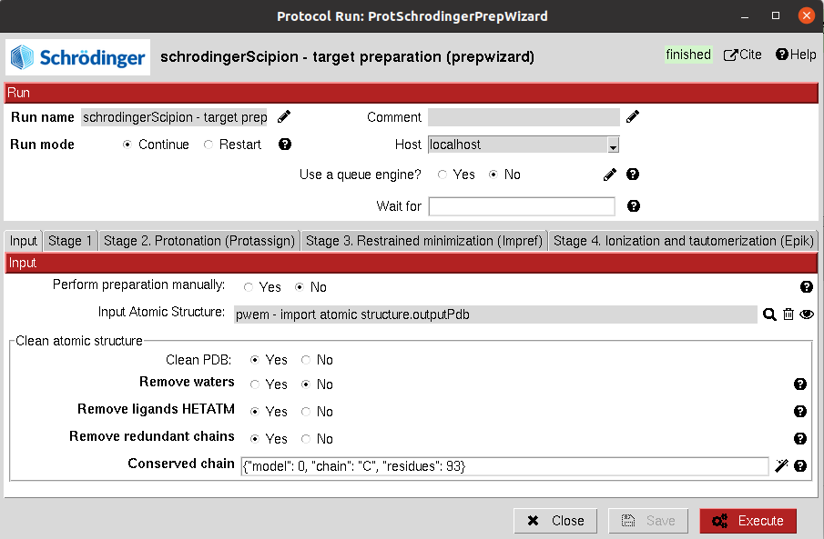

:orphan: true

.. _schrodinger-receptor-preparation:

###############################################################
Schrödinger Receptor Preparation
###############################################################
This protocol prepares an ``AtomStruct`` object containing a protein file to make it ready for Schrodinger tools using the `Prepwizard <https://www.schrodinger.com/science-articles/protein-preparation-wizard>`_ Schrodinger utility.
The protocol contains 4 sections with different parameters that define the receptor preparation, including protonation, energy minimization, ionization and tautomerization. 

From Scipion Chem, we also provide the option of cleaning the structure from HETATM atoms and selecting specific chains from the input structure.

An additional option is included to manually perform this receptor preparation using prepwizard from Schrodinger's GUI.

Input
----------------------------------------
.. include:: ../../../../templates/plugins/input-help.rst

|

The result of this protocol is an ``AtomStruct`` object containing the resulting maestro file of the receptor, ready for other Schrodinger tools.

.. |testCommand| replace:: schrodingerScipion.tests.main_wf.TestSchroProtPrep
.. include:: ../../../../templates/plugins/protocol-test.rst
