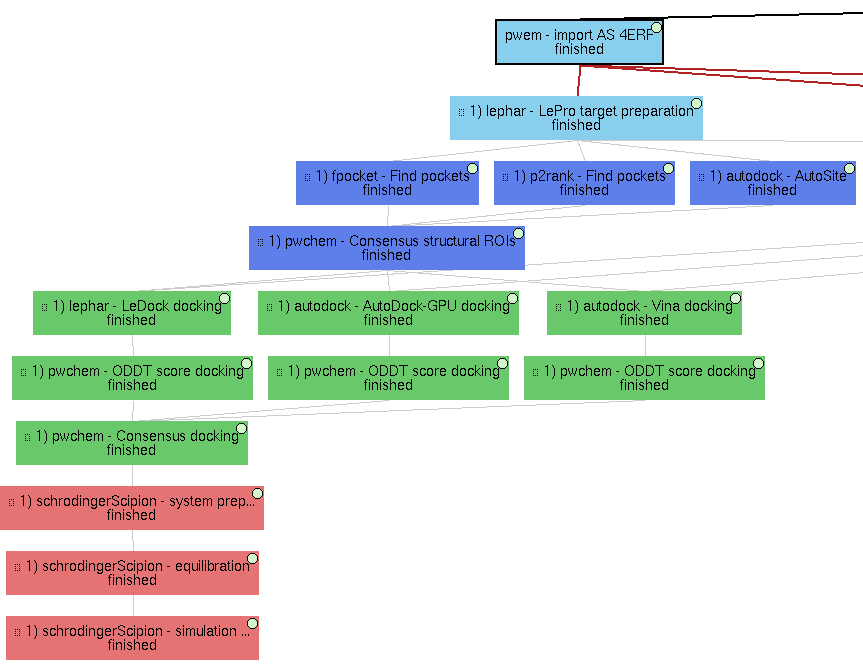
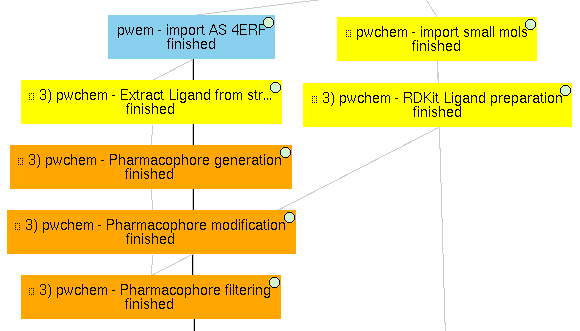
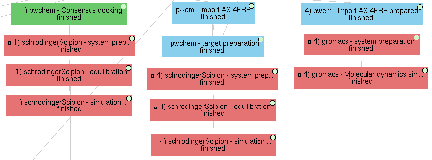
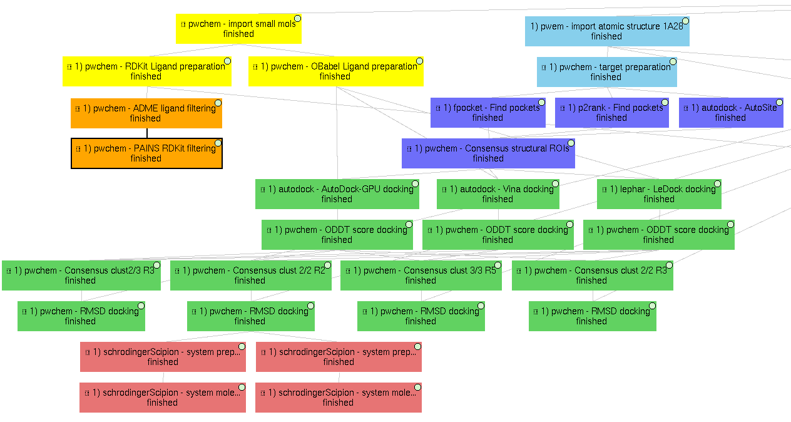
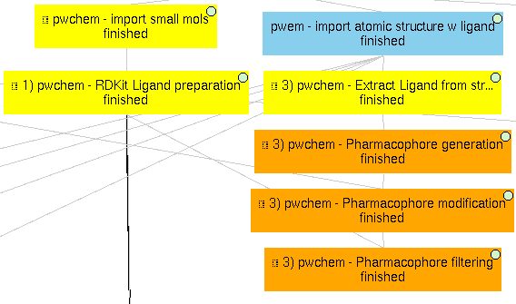

================================
Scipion-chem VDS Data
================================

This repository contains all the data discussed in the Scipion-chem paper. These are:

Virtual Drug Screening workflow example (4erf_workflow)
-----------------------------------------------------------

Example shown in "Virtual Drug Screening workflow" section for 4ERF PDB structure. Contains the Scipion project
folder, which can be imported into the Scipion workflow engine and reproduced once all the necessary plugins are
installed.
The example can be divided into 4 subworkflows, which are examples of useful tasks discussed in the paper. The protocols
related to each of these subworkflows can be identified by their labels in the GUI, which have the form:

<Subworkflow number> ) <Plugin> - <Task performed>

Images are added in this document to localize the subworkflows, but note that the protocols might appear disordered.

These subworkflows are:

1) Main VDS workflow
~~~~~~~~~~~~~~~~~~~~~

Principal workflow that includes protocols following the "Virtual Drug Screening workflow" section:

1) **Molecules import**
    - **Receptor import**: 4ERF structure from PDB web, a ligase from Homo Sapiens
    - **Small molecules import**: 4 ZINC small molecule structures are imported from local "mol2" files
      (included in this repository).

2) **Molecules preparation**
    - **Receptor preparation**: we used LePro protein preparation (from LePhar) to prepare the receptor, removing
      the ligand included in the structure and other heteroatoms and extracting only chain A.
    - **Small molecules preparation**: we used OpenBabel ligand preparation in order to add charges to the imported
      small molecules and generating up to 2 conformers for each of them.

3) **Molecules filtering**
    - **Regions Of Interest definition**: set of protocols that tries to find the most promising regions of the
      receptor for interacting with the ligand. We did so by, first, independently predicting these receptor
      pockets with FPocket, P2Rank and AutoSite. Then, the results of each software are combined using the
      consensus protocol as explained in the paper.

4) **Docking**

   Prepared small molecules are docked onto the consensus ROIs. This task is performed independently using
   LeDock, AutoDock-GPU and Vina, with default parameters. Then, as explained in the paper, the results of
   these protocols are rescored using ODDT Vina and RFScore_v3. Finally, the rescored docking poses are
   combined and the most promising ones are extracted using the consensus protocol.

5) **Molecular dynamics**

   The best scored docking pose from the consensus docking protocol (ZINC1453, according to the ODDT Vina score)
   is used as input for the Molecular dynamics simulation example. To do so, we used Desmond, from Schrödinger.
   We used this commercial software because of the advanced trajectory analysis and the automatic ligand
   parametrization they provide.

   - System preparation: the docked molecule (together with the receptor) is surrounded by a water box
     (with 5A buffer) with the SPC water model. Na+ and Cl- are added to reach 0.15M concentration and
     neutralizing the system. S-OPLS main force field is used to parametrize the system.
   - Simulation: the prepared system is simulated in this protocol using Desmond. First, the system is
     minimized and equilibrated following the default Desmond procedure. Then, a small production simulation
     is executed, enlarging the trajectory with 24ps of unrestricted simulations.
   - Production simulation: a second simulation protocol is executed to generate a larger production simulation
     of 5000ps of unrestricted simulation at native conditions, generating a trajectory that could be analyzed.

|

2) Structural ROIs definition
~~~~~~~~~~~~~~~~~~~~~~~~~~~~~~
This Scipion project also includes several examples on how to determine the structural ROIs discussed in the paper.

.. image:: ../../../_static/images/publications/scipion-chem_vds/subworkflow2_4erf.png
   :alt: rois workflow 4erf

1) **Manual definition**

    We show a manual structural ROI definition in the 4ERF-A structure based on the area of its own ligand.

2) **Mapping from sequence ROIs**

    Similarly to structural ROIs, Scipion-chem includes several ways to define Regions Of Interest over sequences. In this
    example, we manually define two sequence ROIs on residues 1-4 and 22-25, which are then mapped to the structure in
    order to define structural ROIs.

3) **Based on target characteristics**

    As explained in the paper, another option to define structural ROIs is based on target characteristics. In this
    example, the SASA (Solvent-Accessible Surface Area) is calculated over the 4ERF-A structure. From it, a protocol
    extract the sequence ROIs containing higher values of SASA, and these are mapped to structural ROIs.

4) **Predicted pockets**

    From the previous subworkflow, we have already shown an example of how structural ROIs can be defined using programs
    that predict these protein concavities we call pockets.

|

3) Pharmacophore-based workflow
~~~~~~~~~~~~~~~~~~~~~~~~~~~~~~~
As described in the paper, Scipion-chem includes some features to perform pharmacophore-based virtual screening. In this
project, an example is shown.

To do so, the actual ligand of 4ERF is first extracted and a pharmacophore is generated from it. This resulting
pharmacophore is slightly modified to be more flexible using another Scipion-chem protocol, and this modified
pharmacophore is finally used as a filter for out set of 4 small molecules. In this example, as the pharmacophore
features are built using RDKit, we prepared the small molecules using RDKit too. The position of ZINC1099, fitted into
the pharmacophore, is shown in the figure of the paper related to this section.

We prepared the molecules using RDKit because, unfortunately, the full
interoperability is not yet achieved in Scipion-chem, and this is an example of it. Sometimes, small molecules
prepared with OpenBabel would not be parsed properly with RDKit and the protocols would fail.

|

4) Molecular dynamics (MD)
~~~~~~~~~~~~~~~~~~~~~~~~~~~~~~~
Finally, this demo project also includes several examples of molecular dynamics simulations.

1) **On a docked molecule**

    As described in the "Main VDS workflow" section, a molecular dynamics simulation is
    performed using Desmond over the most promising docked molecule.

2) **On the original complex**

    The project includes an example the performs a MD simulation on the actual ligand of
    4ERF (OR3) together with its receptor. This simulation is again performed on Desmond, since MD simulations with ligands
    are not yet supported in gromacs or amber (they will hopefully come soon).

3) **Only on the receptor**

    Finally, a MD simulation is performed on the receptor only, this time using Gromacs. As for
    the previous cases, a first protocol is used to define the system, with the water box, ions and force fields; and a
    second protocol actually executes the simulation, which can be visualized using PyMol or VMD (recommended). Moreover,
    several Gromacs trajectory analysis can be executed from the Scipion GUI in the Analyze results option.

    Note that the receptor file used for this subworkflow comes from a local file (4erf_prepared.pdb, included in this
    repository). This file was obtained using PDBFixer, a software from OpenMM, using scipion-chem-scipionOpenmm, a plugin
    not yet released. We use this because Gromacs needs a deep preparation of the input receptor in order to run.

|
|

Show case (FABP4_workflow)
-----------------------------------------------------------

In this example, a bigger dataset extracted from the database `DUD-E <https://dude.docking.org/>`_ is used to validate
our workflow engine. The specific dataset used is `FABP4 <https://dude.docking.org/targets/fabp4>`_ , corresponding to
the PDB structure `2NNQ <https://www.rcsb.org/structure/2nnq>`_).
The files contained the receptor structure plus an original set of 47 active molecules and around 50 decoys per
active, accounting for a total of 2749 decoy molecules.

As described in the paper, a similar workflow than the one used for 4ERF is run over this new, bigger dataset, as an
example of Scipion-chem and to validate its VDS tools. Below, we will explain step by step the protocols contained in
this workflow, together with their corresponding inputs, outputs and intermediate viewers.

1) **Import** 
    The initial receptor and ligand structures can be imported in several ways, as we explained in the previous workflow. 
    In this example, we imported the structures directly from the pdb files (for the receptor, corresponding to PDB 
    `2NNQ <https://www.rcsb.org/structure/2nnq>`_) and sdf files (for the ligands) files provided by DUD-E. 
    The forms provided by Scipion (in the images below) allow the user to choose the origin of the structure and, 
    in the case of the small molecules, the molecule handler (RDKit or OpenBabel) to use and if a 3D reconstruction is needed.

.. list-table:: 

    * - .. figure:: ../../../_static/images/publications/scipion-chem_vds/formImportReceptor_fabp4.png
           :height: 325

           Import receptor form

      - .. figure:: ../../../_static/images/publications/scipion-chem_vds/formImportMols_fabp4.png
           :height: 325

           Import active molecules form

2) **Preparation**
    Once the structures are imported into the Scipion workflow, separate preparation steps are performed 
    for the receptor and the ligand libraries. In this case, we used the protein preparation protocol in the OpenMM plugin, 
    which uses PDBFixer for the receptor protein; and RDKit for the preparation of the ligands. In each of the forms, 
    the user is asked about the preparation parameters desired, such as to removing undesired atoms (waters and other non-protein 
    entities) or reconstructing missing atoms in the receptor; or which force fields to use and whether to generate conformers 
    in the parametrization of the ligands.

.. list-table:: 

    * - .. figure:: ../../../_static/images/publications/scipion-chem_vds/formProtPrep_fabp4.png
           :height: 375

           Receptor preparation form

      - .. figure:: ../../../_static/images/publications/scipion-chem_vds/formLigPrep_fabp4.png
           :height: 375

           Ligands preparation form

3) **ROI definition**
    In this particular example, P2Rank is used to predict the most promising pockets in our receptor, 
    which will become those ROIs where we will direct the docking processes. In this step, the main P2Rank protocol is followed by 
    a filter protocol to extract only the 2 best pockets predicted, in order to speed up the downstream workflow. 
    The forms for both protocols are shown, where the corresponding parameters are defined.

.. list-table:: 

    * - .. figure:: ../../../_static/images/publications/scipion-chem_vds/formP2Rank_fabp4.png
           :height: 325

           P2Rank ROI prediction form

      - .. figure:: ../../../_static/images/publications/scipion-chem_vds/formFilterROI_fabp4.png
           :height: 325

           Filter top 2 predicted ROIs form

4) **Ligand-based filtering**
    On the ligands side, a first filtering step is used by passing 1 ligand-based filter protocol 
    to our active and decoy molecules. This is the ADME filter, which we described in the previous section. 
    The parameters defined in the form determine the specific rules to follow in ADME execution.   

.. list-table:: 

    * - .. figure:: ../../../_static/images/publications/scipion-chem_vds/formADME_fabp4.png
           :height: 350

           ADME ligand-based filter form

5) **Docking**
    This steps involves the execution of 3 independent docking programs (AutoDock-GPU, AutoDock Vina and LeDock) 
    over the 2 defined ROIs and both the active and decoy prepared libraries. In practise, this is the slowest step of the workflow, 
    and therefore becomes the usual bottleneck in its execution, so it is important to choose appropriate resources for them. 
    In our case, the forms allow us to define the number of threads and GPUs (only for AutoDock-GPU) 
    to allocate for each of them. Moreover, as the previous cases, the forms also include the parameters that the user can tweak 
    to define the docking processes, such as the number of docking poses to generate for each of the molecule conformers.

.. list-table:: 

    * - .. figure:: ../../../_static/images/publications/scipion-chem_vds/formADGPU_fabp4.png
           :height: 450

           AutoDock-GPU docking form

    * - .. figure:: ../../../_static/images/publications/scipion-chem_vds/formLeDock_fabp4.png
           :height: 350

           LeDock docking form

    * - .. figure:: ../../../_static/images/publications/scipion-chem_vds/formVina_fabp4.png
           :height: 450

           Vina docking form

6) **Rescoring**
    In order to combine and compare the docking poses generated by each of the software, we need to first evaluate 
    those poses using the same scoring function. In this case, we use the ODDT score protocol to rescore all the docking poses with 
    its Vina score function.

.. list-table:: 

    * - .. figure:: ../../../_static/images/publications/scipion-chem_vds/formRescore_fabp4.png
           :height: 400

           ODDT docking rescoring form

7) **Filter and consensus**
    Finally, the rescored poses can be combined, ranked and the consensus protocol can be applied 
    to cluster and extract the most promising docking positions. The forms shown below refer to the filter and 
    consensus protocols and their parameters, which are described below. In our example, different combinations of ranking 
    filters and consensus parameters were used in order to evaluate the results. Nine different filtered subsets of our docked 
    molecules containing the 0.01, 0.05, 0.1, 0.5, 1, 5, 10, 50 and 100 \% of the highest scored poses were generated to be used in the 
    consensus protocol. 
    Then, for each of these subsets, 2 consensus protocols were executed with a difference in a vital parameter. First, both 
    consensus runs will produce the same pose clusters; however, one of the consensus executions will only consider sufficient 
    those clusters containing at least one pose from each of the 3 docking software (N3) while the other, more permissive one, 
    will consider sufficient those that contain at least poses from 2 docking software (N2). This way, we intend to generate sets 
    enriched in active molecules and smaller than the original set of 2796 molecules.

.. list-table:: 

    * - .. figure:: ../../../_static/images/publications/scipion-chem_vds/formScoreFilter_fabp4.png
           :height: 325

           Top scoring filter form

      - ..  figure:: ../../../_static/images/publications/scipion-chem_vds/formConsensus_fabp4.png
           :height: 425

           Consensus docking form

|

The results of this experiment comparing the filtering vs N2 consensus are contained in Fig. \ref{fig:ConsResN2},
where we can observe the enrichment of actives vs decoys of the output subsets and the total number of molecules 
kept for each of them. Subsets labeled \%x show the enrichment for the sets generated only passing the score-filter, 
while those labeled \%x\_N2 represents the corresponding set generated after passing the score filter plus consensus protocol. 
A similar image with the results for the N3 consensus, which gave similar results, can be found in the supplementary material.

As we can infer from the graphs, both strategies lead to a considerable enrichment of the original dataset as the percentage of actives 
(blue bars) is generally enhanced, while the number of total molecules in the subset (red line) is reduced. For our FABP4 example, 
from the original 2796 (47 actives to 2749 decoys) molecules (1.68\% of actives); we got considerable enrichment in both the 
filtered and filter plus consensus subsets. For instance, we obtained a subset of 64 molecules where 11 actives were kept 
(17.19\%) for the 0.1\% filtered subset or, once this same subset is passed through the N2 consensus, we further enriched 
it to keep 7 actives out of just 24 molecules (29.17\%).

Therefore, we were able to reduce the total number of molecules of the original set while significantly enhancing the 
proportion of actives. However, the user must be careful not to reduce too much the number of docking poses with the 
score filter since we can observe that subsets below 0.05\% lose all or most of the active molecules.

.. list-table:: 

    * - .. figure:: ../../../_static/images/publications/scipion-chem_vds/bestScoredVSConsN2_molecules_fabp4.png
           :alt: consensus N2 results fabp4

           Scipion-chem consensus N2 protocol enrichment. The graph shows the percentage of actives (in blue bars) and the total 
           number of molecules (red dots) for each of the subsets generated in the workflow. The subset 'Original' represents 
           the original set imported from DUD-E; '\%100' the subset of molecules remaining after the described ligand-based 
           filtering (which slightly improves the enrichment) and then each of the consensus subset generated by applying a 
           best ODDT score ranking filter for the top \%x and consensus docking with parameter N2.

    * - .. figure:: ../../../_static/images/publications/scipion-chem_vds/bestScoredVSConsN3_molecules_fabp4.png
           :alt: consensus N3 results fabp4

           Suplementary Scipion-chem consensus N3 protocol enrichment. The graph shows the percentage of actives (in blue bars) and the total 
           number of molecules (red dots) for each of the subsets generated in the workflow. The subset 'Original' represents 
           the original set imported from DUD-E; '\%100' the subset of molecules remaining after the described ligand-based 
           filtering (which slightly improves the enrichment) and then each of the consensus subset generated by applying a 
           best ODDT score ranking filter for the top \%x and consensus docking with parameter N3.

|

Additionally, the figure below represents the experimental values for the interaction of the active molecules and the receptor.
Each of the points represent an active molecule, placed depending on their experimental value (either Ki in blue or IC50 in red) 
and their best pose ODDTScore. Those points with a yellow star correspond to the active molecules present in the best resulting
consensus dataset (%0.1_N2). As we can observe, the ODDTScore seems to correlate relatively well, and most of the highest ODDTScores
represent the best experimental affinities, which are captured in the consensus. 

.. list-table:: 

    * - .. figure:: ../../../_static/images/publications/scipion-chem_vds/activesExpAffinities_InConsensus_0.1_n2.png
           :alt: consensus N2 0.1% experimental affinities

           Experimental values of actives against ODDTScore. Yellow stars specify actives found in the best consensus set.

|
|

Supplemental workflow (1a28_workflow)
-----------------------------------------------------------
Similar workflows can be found in 1a28_workflow, with a few variations described in section "Show case" of the paper.
The same pattern ( <Subworkflow number> ) <Plugin> - <Task performed> ) is used to describe identify the subworkflow
each of the protocols belongs to. In this case, the subworkflows are:

1) Main VDS workflow
~~~~~~~~~~~~~~~~~~~~~
Principal workflow that includes protocols following the "Show case" section:

1) **Molecules import**
    - **Receptor import**: 1A28 structure from dcoid dataset, corresponding to 1A28 PDB entry, the progesterone receptor
      linked to its ligand progesterone. The ligand is removed from the original structure in order to get the receptor
      structure.
    - **Small molecules import**: the 4 small molecule provided in the dcoid dataset (DOI: 10.17632/8czn4rxz68.1) are
      imported from local files. These include the active molecule (progesterone) and 3 decoys which have been proved
      not to interact with the receptor.

2) **Molecules preparation**
    - **Receptor preparation**: we used Scipion-chem protocol (using biopython) to prepare the receptor, removing
      water and other heteroatoms.
    - **Small molecules preparation**: we used OpenBabel ligand preparation in order to add charges to the imported
      small molecules and generating up to 5 conformers for each of them.

3) **Molecules filtering**
    - **Ligand filtering**: RDKit ADME and PAINS filter protocols are executed over the input molecules (previously
      prepared with RDKit). The 4 of them pass the filters.

    - **Regions Of Interest definition**: set of protocols that tries to find the most promising regions of the
      receptor for interacting with the ligand. We did so by, first, independently predicting these receptor
      pockets with FPocket, P2Rank and AutoSite. Then, the results of each software are combined using the
      consensus protocol as explained in the paper. These resulting ROIs contain both the actual pocket of the
      progesterone and the same pocket in the dimer, which is not occupied in the actual structure, as shown in the
      figure in the paper related to this section.

4) **Docking**

   Prepared small molecules are docked onto the consensus ROIs. This task is performed independently using
   LeDock, AutoDock-GPU and Vina, with default parameters. Then, as explained in the paper, the results of
   these protocols are rescored using ODDT Vina, RFScore_v3 and NNScore. Finally, the rescored docking poses are
   combined and the most promising ones are extracted using the consensus protocol, with the different parameters
   explained in the paper. The name of the protocol specifies the parameters as: asking the clusters to contain x
   out of y input source poses (clut x/y) and with intra-cluster maximum RMSD of z (Rz).
   An additional protocol is added in this workflow to measure the RMSD distance of each of the docking poses to the
   actual ligand position.

5) **Molecular dynamics**

   The best 2 scored docking pose from the consensus docking protocol (which are the actual ligand, progesterone,
   according to all the tried scores) are used as input for the Molecular dynamics simulation example.
   Each of them come from a different pocket, but have similar scores, are stated in the paper.
   To do so, we used Desmond, from Schrödinger. We used this commercial software because of the advanced trajectory
   analysis and the automatic ligand parametrization they provide.

   - System preparation: the docked molecule (together with the receptor) is surrounded by a water box
     (with 5A buffer) with the SPC water model. Na+ and Cl- are added to reach 0.15M concentration and
     neutralizing the system. S-OPLS main force field is used to parametrize the system.
   - Simulation: the prepared system is simulated in this protocol using Desmond. First, the system is
     minimized and equilibrated following the default Desmond procedure. Then, a small production simulation
     is executed, enlarging the trajectory with 24ps of unrestricted simulations.

|

2) Structural ROIs definition
~~~~~~~~~~~~~~~~~~~~~~~~~~~~~~
This Scipion project also includes one example on how to determine structural ROIs based on mutations or variants
of the original receptor sequence and known binding residues.

|

3) Pharmacophore-based workflow
~~~~~~~~~~~~~~~~~~~~~~~~~~~~~~~
This project includes the pharmacophore-based screening described in the paper.

To do so, the actual ligand of 1A28 is first extracted and a pharmacophore is generated from it. This pharmacophore
is used as a filter for out set of 4 small molecules. In this example, as the pharmacophore
features are built using RDKit, we prepared the small molecules using RDKit too. The only small molecule fitted into
the pharmacophore is the actual ligand, the progesterone, shown in the figure of the paper related to this section.

|

4) Molecular dynamics (MD)
~~~~~~~~~~~~~~~~~~~~~~~~~~~~~~~
Finally, this project also includes several examples of molecular dynamics simulations.

1) **On a docked molecule**

    As described in the "Main VDS workflow" section, two molecular dynamics simulation are
    performed using Desmond over the most promising docked molecules.

2) **Only on the receptor**

    Finally, a MD simulation is performed on the receptor only, this time using Gromacs. As for
    the previous cases, a first protocol is used to define the system, with the water box, ions and force fields; and a
    second protocol actually executes the simulation, which can be visualized using PyMol or VMD (recommended). Moreover,
    several Gromacs trajectory analysis can be executed from the Scipion GUI in the Analyze results option.
    However, the simulation is not executed in the project, since the resulting trajectory is composed by large files
    that could not be uploaded on GitHub, but the user is free to execute it locally.

|
|

Software availability
-----------------------------------------------------------
All the commented Scipion-chem plugins are built on the Scipion workflow engine, which can be found in
https://scipion.i2pc.es/ .

As stated in the paper, `Scipion-chem <https://github.com/scipion-chem>`_ integrates a set of bioinformatic tools and
software inside the platform.
Most of this tools are open, and no license is required for their use, so Scipion-chem installs it automatically,
taking care of properly referencing all the sources.

In the case of the few licensed software, the user must install
either the programs or the license by themselves and tell Scipion-chem where the software is installed. More detailed
guides on how to proceed with the installations can be found in the repositories of each of the plugins.

A complete list of these software, organized by the plugins they are installed on, is described below. The versions
refer to the moment this document is being written, but updates are constantly being made.

1) `Scipion-chem: <https://github.com/scipion-chem/scipion-chem>`_ as the core plugin, it installs a wide set of tools.

    - OpenBabel 2.2 (conda)
    - RDKit 2021.09.4 (conda)
    - MGLTools 1.5.7 (https://ccsb.scripps.edu)
    - Shape-it 2.0.0 (https://github.com/rdkit/shape-it.git)
    - JChemPaint 3.2.0 (https://sourceforge.net/projects/cdk/files/JChemPaint)
    - PyMol 2.5.5 (https://pymol.org/installers)
    - AliView 1.28 (https://ormbunkar.se/aliview)
    - VMD 1.9.3 (conda)
    - MDTraj 1.9.8 (conda)

2) `Scipion-chem-amber: <https://github.com/scipion-chem/scipion-chem-amber>`_

    - AmberTools 21 (conda)

3) `Scipion-chem-autodock: <https://github.com/scipion-chem/scipion-chem-autodock>`_

    - AutoDockSuite 4.2.6 (https://autodock.scripps.edu)
    - AutoDock-GPU (https://github.com/ccsb-scripps/AutoDock-GPU.git as in 2023/04/14)
    - Vina 1.2.3 (https://github.com/ccsb-scripps/AutoDock-Vina.git)
    - ADFRSuite 1.0 (https://ccsb.scripps.edu/adfr)
    - Meeko 0.3.3 (pip)

4) `Scipion-chem-blast: <https://github.com/scipion-chem/scipion-chem-blast>`_

    - BLAST+ 2.12.0 (https://ftp.ncbi.nlm.nih.gov/blast)

5)  `Scipion-chem-fpocket: <https://github.com/scipion-chem/scipion-chem-fpocket>`_

    - FPocket 3.0 (conda)

6) `Scipion-chem-gromacs: <https://github.com/scipion-chem/scipion-chem-gromacs>`_

    - Gromacs 2021.5 (https://ftp.gromacs.org/gromacs)

7) `Scipion-chem-lephar: <https://github.com/scipion-chem/scipion-chem-lephar>`_

    - LeDock - (http://www.lephar.com as in 2023/04/14)
    - LePro - (http://www.lephar.com as in 2023/04/14)

8) `Scipion-chem-modeller: <https://github.com/scipion-chem/scipion-chem-modeller>`_

    - Modeller 10.4 (conda) *License Key needed

9) `Scipion-chem-p2rank: <https://github.com/scipion-chem/scipion-chem-p2rank>`_

    - P2Rank 2.3 (https://github.com/rdk/p2rank)

10) `Scipion-chem-rosetta: <https://github.com/scipion-chem/scipion-chem-rosetta>`_

    - Rosetta 3.12 (-) *Need user installation

11) `Scipion-chem-schrodingerScipion: <https://github.com/scipion-chem/scipion-chem-schrodingerScipion>`_

    - Schrödinger Suite 2021-3 (-) *Need user installation and key
