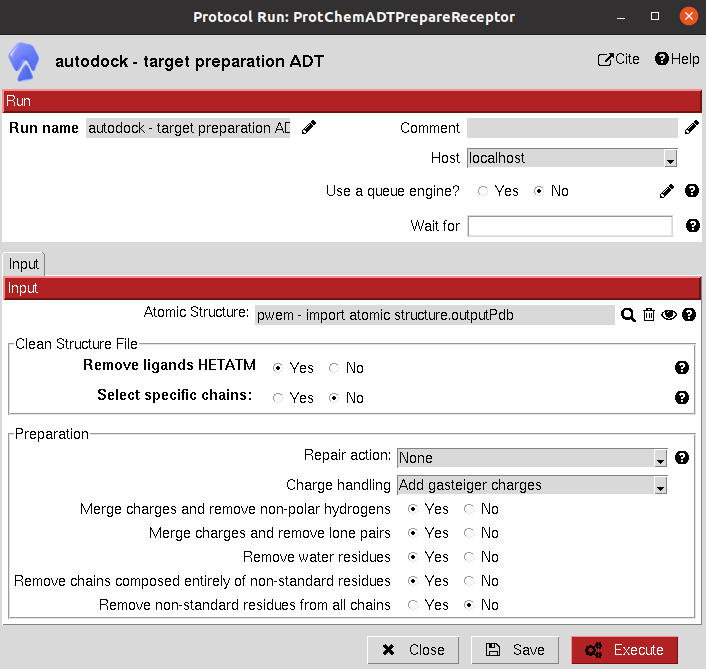
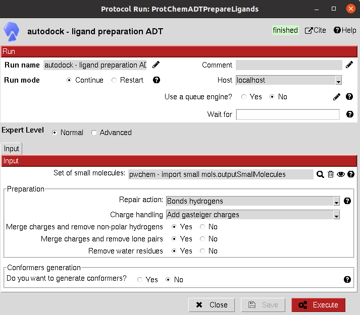
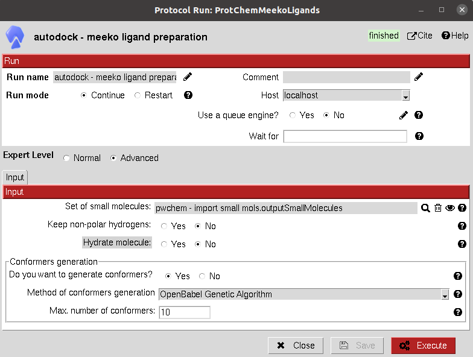
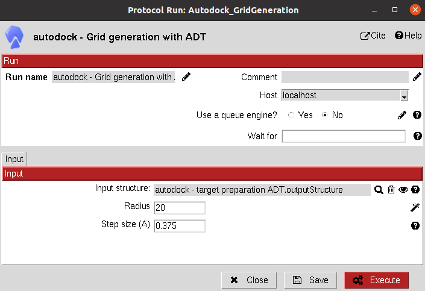
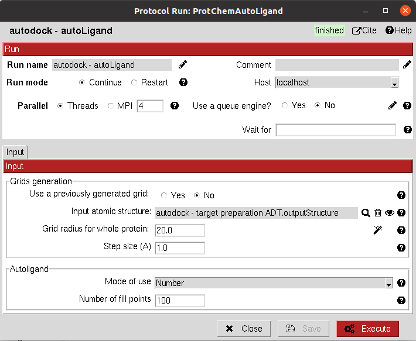
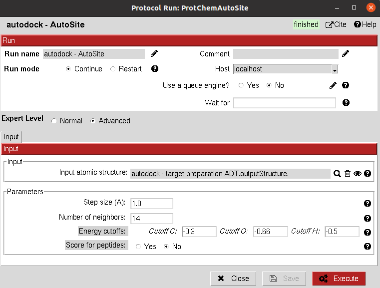
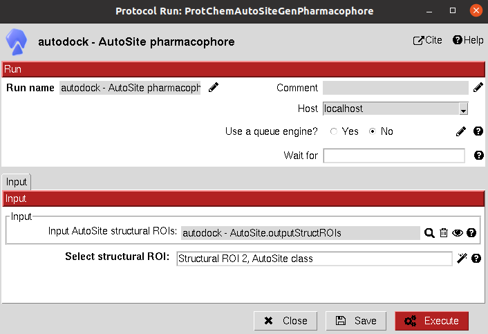
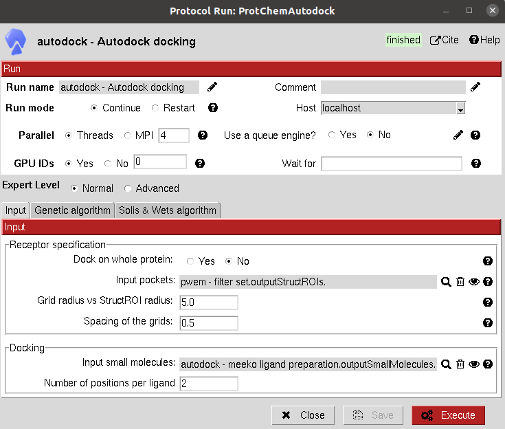
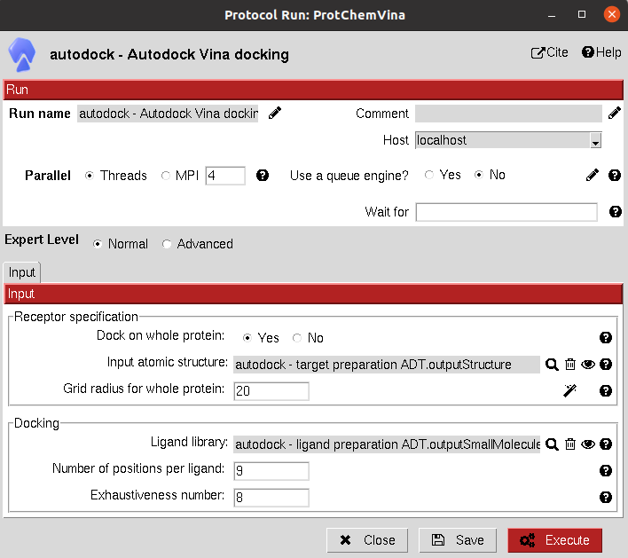

.. _docs-chem-autodock:

.. figure:: ../images/autodock_logo.png
   :alt: autodock logo

Welcome to Scipion-chem-autodock's documentation!
=================================================
In order to use this plugin, you need to install first Scipion-chem.
`Scipion-chem <https://github.com/scipion-chem/docs>`_
is the core for the rest of scipion-chem-\* plugins. To do so, you can check the instructions in the
`Scipion-chem README <https://github.com/scipion-chem/scipion-chem/blob/master/README.rst>`_.

Similarly, you can find the installation instructions of this plugin in
`Scipion-chem-autodock README <https://github.com/scipion-chem/scipion-chem-autodock/blob/master/README.rst>`_

|

Scipion-chem-autodock overview
========================================
`AutoDock <https://autodock.scripps.edu/>`_ is a suite of automated docking tools. It is designed to predict how small
molecules, such as substrates or drug candidates, bind to a receptor of known 3D structure. Over the years, it has
been modified and improved to add new functionalities, and multiple engines have been developed.

Scipion-chem-autodock protocols
========================================

**Receptor preparation**
-------------------------------
This protocol prepares an AtomStruct object containing a protein file to make it ready for AutoDock tools, such as
docking with AutoDock or Vina. Several options for managing non-standard residues, repairing hydrogens and bonds and
estimating partial charges are included. It uses the script *prepare_receptor4.py* in the utilities of AutoDock Tools.

From Scipion-chem, we also provide the option of cleaning the structure from HETATM atoms and selecting specific
chains from the input structure.

All parameters include a help button that gives further information for each of them.

|

|

The result of this protocol is an AtomStruct object containing the resulting pdbqt file of the receptor, ready for
other AutoDock tools.

A test for this protocol can be run using::
    scipion3 tests autodock.tests.test_autodock.TestADPrepareReceptor

|

**Ligand preparation**
-------------------------------
In Scipion-chem-autodock, we offer 2 different protocols for ligand preparation. Both take a SetOfSmallMolecules as
input and prepare them by adding hydrogens, fixing bonds and calculate partial charges, generating the pdbqt files
needed for posterior docking analysis.
From Scipion-chem, we also add the option for conformer generation. However, in the case of AutoDock docking programs,
this step can be skipped since the ligands are treated as flexible on their rotable bonds.

These protocols are:

1) **Ligand preparation:** It uses the script *prepare_ligand4.py* in the utilities of AutoDock Tools.

2) **Ligand preparation meeko:** It uses the new `Meeko <https://github.com/forlilab/Meeko>`_ functionality as a Python
module.

|

|form2_1| |form2_2|

|

The result of this protocol is a SetOfSmallMolecules, containing the prepared ligands.

|

Tests for these protocols can be run using::
    scipion3 tests autodock.tests.test_autodock.TestADPrepareLigands

    scipion3 tests autodock.tests.test_autodock.TestADMeekoLigands

|

**Grid generation**
-------------------------------
This protocol generates the grids used by the different AutoDock programs using autogrid4. The protocol is currently
deprecated since all the necessary grids are internally generated by the protocols described below. It might just be
useful to generate and then check the resulting grids.

All parameters include a help button that gives further information for each of them.

|

|

A test for this protocol can be run using::
    scipion3 tests autodock.tests.test_autodock.TestGridADT

|

**Binding site identification**
-------------------------------
In Scipion-chem-autodock, we offer 2 different protocols for binding site prediction. Both take an AtomStruct as
input, which should be prepared, and predict the most promising binding sites on the structure.

The included protocols are:

1) `AutoLigand: <https://autodock.scripps.edu/resources/autoligand/>`_ It uses AutoLigand tool to predict the binding sites. The user must be aware that this method is deprecated and will soon be deleted so they should use AutoSite instead.

2) `AutoSite: <https://ccsb.scripps.edu/autosite/>`_ It uses the new AutoSite functionality for binding site prediction.

|

|form3_1| |form3_2|

|

The results of these protocols are a SetOfStructROIs (Structural Regions Of Interest), containing the predicted binding
sites. The user can visualize them using **Analyze Results**, which will display the General StructROIs viewer.

Tests for these protocols can be run using::
    scipion3 tests autodock.tests.test_autodock.TestAutoLigand

    scipion3 tests autodock.tests.test_autodock.TestAutoSite

These tests contain the tests for Receptor Preparation described above.

|

**Pharmacophore generation**
-------------------------------
This protocol generates a Pharmacophore object RDKit compatible from a resulting binding site of AutoSite. This
pharmacophore objects can later be modified or used to filter compatible molecules using pharmacophore
Scipion-chem protocols.

|

|

The result of this protocol is an Pharmacophore object containing the hydrophobic, H-donor and H-acceptor cluster
centers described in the AutoSite output.

A test for this protocol can be run using::
    scipion3 tests autodock.tests.test_autodock.TestAutoSitePharmacophore

|

**Docking**
-------------------------------
In Scipion-chem-autodock, we offer 2 different protocols for docking. Both take can take as input either an AtomStruct
(to perform the docking on the whole protein) or a SetOfStructROIs (to perform the docking only on the Structural
Regions Of Interest).

The included protocols are:

1) `AutoDock4: <https://autodock.scripps.edu/download-autodock4/>`_ It uses AutoDock4 tool to predict the binding poses for a set of small molecules over the receptor. Inside this same protocol, the `AutoDock-GPU <https://github.com/ccsb-scripps/AutoDock-GPU>`_ version is included, which is several times faster and includes many bug fixes and new features..

2) `AutoDock Vina: <https://vina.scripps.edu/>`_ It uses the Vina docking engine to predict the binding poses for a set of small molecules over the receptor.

|

|form4_1| |form4_2|

|

The results of these protocols are a SetOfSmallMolecules, containing the predicted binding poses for the input
molecules. The user can visualize them using **Analyze Results**, which will display the General SmallMolecules viewer.

Tests for these protocols can be run using::
    scipion3 tests autodock.tests.test_autodock.TestAutoDock

    scipion3 tests autodock.tests.test_autodock.TestAutoDockGPU

    scipion3 tests autodock.tests.test_autodock.TestVina

These tests contain the tests for Receptor Preparation, Autosite and Ligand Preparation described above.

|

Get in contact
==================

From the Scipion team we would be happy to hear your doubts and suggestions, do not hesitate to contact us at any
time. To do so, you can either open an issue in the Github repository related to your question or
contact us by mail.

If the question is related to the Scipion framework, try the `contact us <https://scipion.i2pc.es/contact>`_ page.
If it is related to some Scipion-chem plugin or functionality, you can send a mail to
the developer at ddelhoyo@cnb.csic.es

