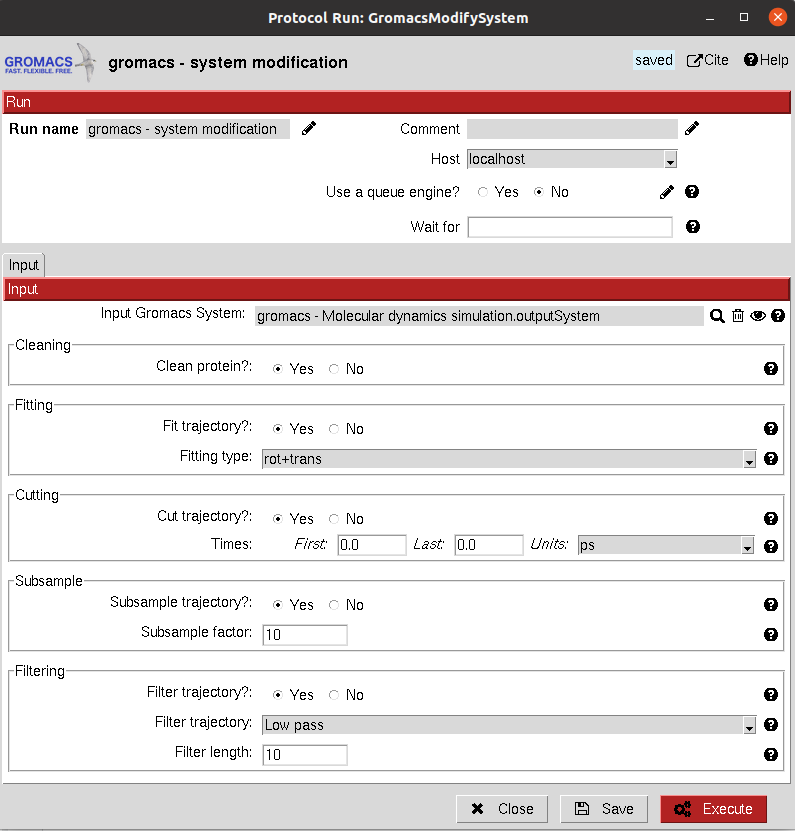

.. _docs-chem-autodock:

.. figure:: ../images/autodock_logo.png
   :alt: autodock logo

Welcome to Scipion-chem-autodock's documentation!
=================================================
In order to use this plugin, you need to install first Scipion-chem.
`Scipion-chem <https://github.com/scipion-chem/docs>`_
is the core for the rest of scipion-chem-\* plugins. To do so, you can check the instructions in the
`Scipion-chem README <https://github.com/scipion-chem/scipion-chem/blob/master/README.rst>`_.

Similarly, you can find the installation instructions of this plugin in
`Scipion-chem-autodock README <https://github.com/scipion-chem/scipion-chem-autodock/blob/master/README.rst>`_

|

Scipion-chem-autodock overview
========================================
`AutoDock <https://autodock.scripps.edu/>`_ is a suite of automated docking tools. It is designed to predict how small
molecules, such as substrates or drug candidates, bind to a receptor of known 3D structure. Over the years, it has
been modified and improved to add new functionalities, and multiple engines have been developed.

Scipion-chem-autodock protocols
========================================

**Receptor preparation**
-------------------------------
This protocol prepares an AtomStruct object containing a protein file to make it ready for AutoDock tools, such as
docking with AutoDock or Vina. Several options for managing non-standard residues, repairing hydrogens and bonds and
estimating partial charges are included. It uses the script *prepare_receptor4.py* in the utilities of AutoDock Tools.

From Scipion-chem, we also provide the option of cleaning the structure from HETATM atoms and selecting specific
chains from the input structure.

All parameters include a help button that gives further information for each of them.

|

.. image:: ../images/autodock_form1.png
   :alt: autodock form1

|

The result of this protocol is an AtomStruct object containing the resultin pdbqt file of the receptor, ready for
other AutoDock tools.

A test for this protocol can be run using::
    scipion3 tests autodock.tests.test_autodock.TestADPrepareReceptor

|

**Ligand preparation**
-------------------------------
In Scipion-chem-autodock, we offer 2 different protocols for ligand preparation. Both take a SetOfSmallMolecules as
input and prepare them by adding hydrogens, fixing bonds and calculate partial charges, generating the pdbqt files
needed for posterior docking analysis.
From Scipion-chem, we also add the option for conformer generation. However, in the case of AutoDock docking programs,
this step can be skipped since the ligands are treated as flexible on their rotable bonds.

These protocols are:

1) **Ligand preparation:** It uses the script *prepare_ligand4.py* in the utilities of AutoDock Tools.

2) **Ligand preparation meeko:** It uses the new Meeko functionality as a Python module.

|

|form1| |form2|

.. |form1| image:: ../images/autodock_form2_1.png
   :alt: autodock form2_1
   :width: 45%

.. |form2| image:: ../images/autodock_form2_2.png
   :alt: autodock form2_2
   :width: 45%

|

The result of this protocol is a SetOfSmallMolecules, containing the prepared ligands.

|

Tests for these protocols can be run using::
    scipion3 tests autodock.tests.test_autodock.TestADPrepareLigands
    scipion3 tests autodock.tests.test_autodock.TestADMeekoLigands

|

**Binding site identification**
-------------------------------
This protocol performs `modifications <https://manual.gromacs.org/documentation/5.1/onlinehelp/gmx-trjconv.html>`_
over a Gromacs System, specially over its trajectory.

The modifications include:
    - **Cleaning**: removing waters and ions
    - **Fitting**: Fit trajectory to initial structure
    - **Dropping**: Cut a trajectory, saving only from first to last specified times
    - **Subsampling**: Subsample trajectory frames
    - **Filtering**: Perform low/high pass filters on trajectory frames

|

|

The result of this protocol is a GromacsSystem, containing the modified Gromacs files and trajectory. The user
can visualize the complex using **Analyze Results**.

A test for this protocol can be run using::
    scipion3 tests gromacs.tests.tests.TestGromacsTrajMod

This test contains the tests for System Preparation and MD Simulation described above.

|

Get in contact
==================

From the Scipion team we would be happy to hear your doubts and suggestions, do not hesitate to contact us at any
time. To do so, you can either open an issue in the Github repository related to your question or
contact us by mail.

If the question is related to the Scipion framework, try the `contact us <https://scipion.i2pc.es/contact>`_ page.
If it is related to some Scipion-chem plugin or functionality, you can send a mail to
the developer at ddelhoyo@cnb.csic.es

