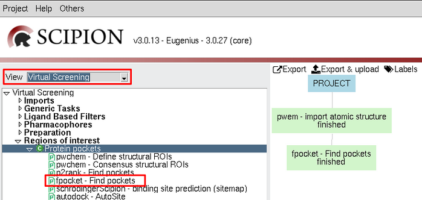
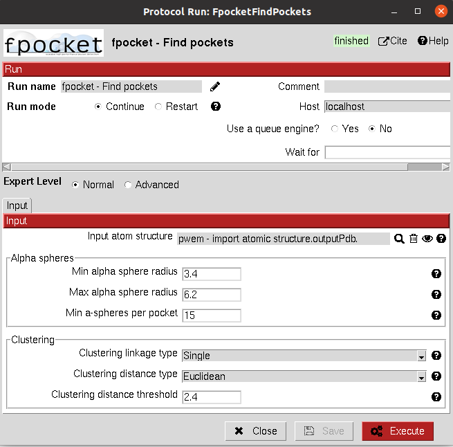
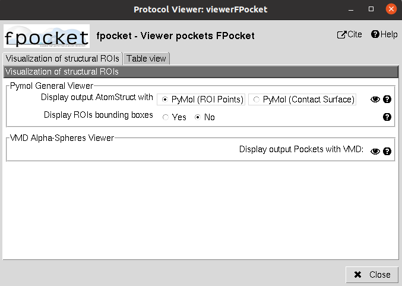
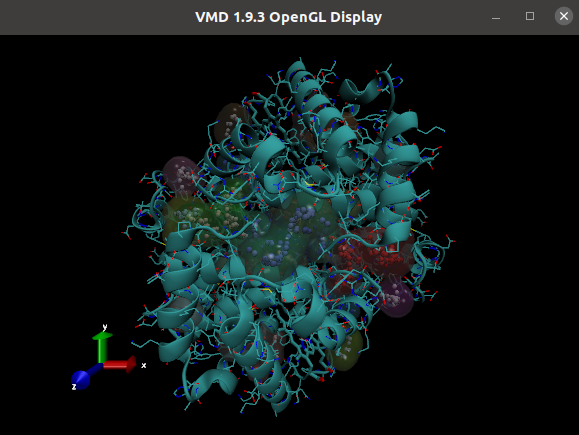

.. _docs-chem-fpocket:

###############################################################
Welcome to Scipion-chem-fpocket's documentation!
###############################################################
In order to use this plugin, you need to install first Scipion-chem.
`Scipion-chem <https://github.com/scipion-chem/docs>`_
is the core for the rest of scipion-chem-\* plugins. To do so, you can check the instructions in the
`Scipion-chem README <https://github.com/scipion-chem/scipion-chem/blob/master/README.rst>`_.

Similarly, you can find the installation instructions of this plugin in
`Scipion-chem-fpocket README <https://github.com/scipion-chem/scipion-chem-fpocket/blob/master/README.rst>`_

|

Scipion-chem-fpocket overview
******************************************
`FPocket <https://github.com/Discngine/fpocket>`_ is one of the most widely known programs for protein pocket detection.
In this plugin we include the main tool for pocket prediction, FPocket, together with the tool for predicting pockets
over a Molecular Dynamics simulation, MDPocket (in devel).

|

Scipion-chem-fpocket protocols
******************************************

**Protein pocket detection**
================================
The main program of the FPocket package is fpocket and it is integrated in Scipion-chem-fpocket as a protocol.
Once you have installed the plugin (you will need to restart Scipion), the protocol will appear in the list of
protocols in the "Virtual Screening" view. The protocol is called **fpocket - Find pockets**.
You can also find this or any other protocol searching by keyword with "Ctrl+F".

|

|

The form of the protocol is relatively simple, it just need an input atomic structure (a protein structure).
Then, you can fine tune the different parameters that control the alpha spheres and clustering inside fpocket.
You can check the meaning of this parameters in the help button for each of them, and if you need more information
we recommend you to check the `FPocket documentation <https://github.com/Discngine/fpocket/blob/master/doc/MANUAL.md>`_.

|

|

The result of this protocol is a SetOfStructROIs object, containing the predicted pockets. You can inspect this pockets
using the **Analyze results** button or if you want to directly see the related files you will be able to find them
in the protocol's folder.

A test for this protocol can be run using::
    scipion3 tests fpocket.tests.test_fpocket.TestFPocket

|

Scipion-chem-fpocket viewer
================================
The viewer for fpocket results include the Pymol General Viewer for SetOfStructROIs objects plus an specific viewer of
the alpha-spheres over the protein structure using VMD.

|

|viewer|  |vmd|

|

As for the rest of the Scipion object, you can also check **Table view** to visualize the stored parameters for each of
the items in the set.

|

Get in contact
******************************************

From the Scipion team we would be happy to hear your doubts and suggestions, do not hesitate to contact us at any
time. To do so, you can either open an issue in the Github repository related to your question or
contact us by mail.

If the question is related to the Scipion framework, try the `contact us <https://scipion.i2pc.es/contact>`_ page.
If it is related to some Scipion-chem plugin or functionality, you can send a mail to
the developer at ddelhoyo@cnb.csic.es

