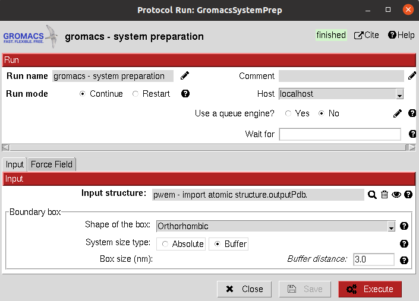

.. _docs-chem-gromacs:

Welcome to Scipion-chem-gromacs's documentation!
=================================================
In order to use this plugin, you need to install first Scipion-chem.
`Scipion-chem <https://github.com/scipion-chem/docs>`_
is the core for the rest of scipion-chem-\* plugins. To do so, you can check the instructions in the
`Scipion-chem README <https://github.com/scipion-chem/scipion-chem/blob/master/README.rst>`_.

Similarly, you can find the installation instructions of this plugin in
`Scipion-chem-gromacs README <https://github.com/scipion-chem/scipion-chem-gromacs/blob/master/README.rst>`_

|

Scipion-chem-gromacs overview
========================================
`Gromacs <https://www.gromacs.org/>`_ is a free and open-source software suite for high-performance Molecular
Dynamics (MD) and output analysis. In Scipion-chem-gromacs, we have integrated tools for preparing MD systems,
running simulations and modifying and analyzing the output trajectories.

Scipion-chem-gromacs protocols
========================================

**System preparation**
-------------------------------
This protocol prepares a Gromacs MD system prior to its simulation from a AtomStruct object. This protein must have
all the atoms including hydrogens, we recommend you to prepare it first with any of our integrated protocols
for receptor preparation.

It allows the user to create a solute boundary box, define the force field and finally specify the ions in the solute,
which can be set to neutralize the charges, or manually add the desired number.

Unfortunately, as for today we do not include the functionality for preparing complexes containing non-protein atoms,
such as ligands. Hopefully it will be coming soon.

All parameters include a help button that gives further information for each of them.

|

|form1| |form1_2|

.. |form1_2| image:: ../images/gromacs_form1_2.png
   :alt: gromacs form1_2
   :width: 50%

|

The result of this protocol is either a GromacsSystem, containing the Gromacs coordinates and topology files. The user
can visualize the complex either with PyMol using **Analyze Results**.

|

.. figure:: ../images/gromacs_out_1.png
   :alt: gromacs out1

|

A test for this protocol can be run using::
    scipion3 tests gromacs.tests.tests.TestGromacsPrepareSystem

|

**Create local database**
-------------------------------
This protocol creates a local database in BLAST format and stores it in the plugin folder. The user can create
databases either from a SetOfSequences or from default databases in BLAST. The user must be aware of this last option,
since most of the BLAST databases are quite big and downloading them will expend high amounts of time and storage.

|

This protocol does not output any object, but it saves the database in the plugin folder.

A test for this protocol can be run using::
    scipion3 tests blast.tests.test_blast.TestDatabaseBLAST

|

.. figure:: ../images/blast_form2.png
   :alt: blast form2

|

**BLAST search**
-------------------------------
This protocol performs a BLAST search over a database, which can be local or a web-server BLAST database.
The input of the protocol is a sequence, which can be from a protein or nucleotide, and the user will be able to define
the type of search (blastp, blastn, blastx, ...).

In the second parameters tab, different parameters for the search can be tuned. If you are
not sure of which parameters to use, click on the wizard and the default parameters for the search type will be set.

|

|

The result of this protocol is a SetOfSequences containing the BLAST hits. The analyze results button will open these
sequences in AliViewer.

A test for this protocol can be run using::
    scipion3 tests blast.tests.test_blast.TestBLAST

|

Get in contact
==================

From the Scipion team we would be happy to hear your doubts and suggestions, do not hesitate to contact us at any
time. To do so, you can either open an issue in the Github repository related to your question or
contact us by mail.

If the question is related to the Scipion framework, try the `contact us <https://scipion.i2pc.es/contact>`_ page.
If it is related to some Scipion-chem plugin or functionality, you can send a mail to
the developer at ddelhoyo@cnb.csic.es

