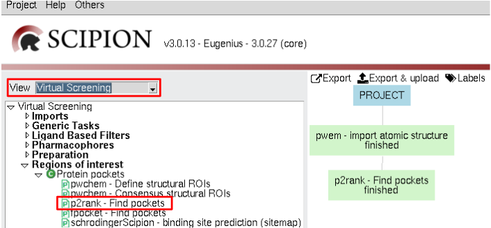
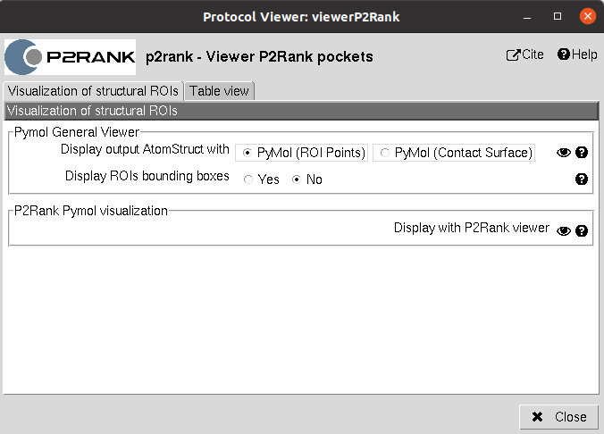
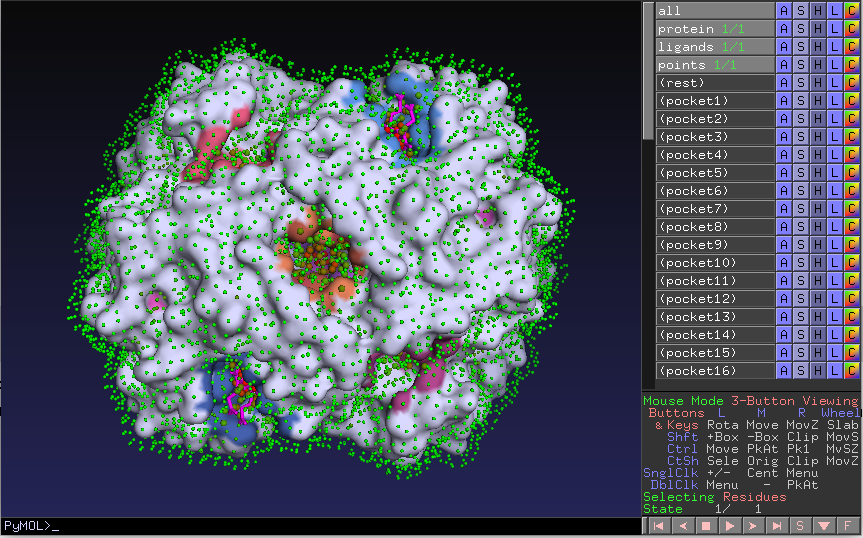

.. _docs-chem-p2rank:

Welcome to Scipion-chem-p2rank's documentation!
=================================================
In order to use this plugin, you need to install first Scipion-chem.
`Scipion-chem <https://github.com/scipion-chem/docs>`_
is the core for the rest of scipion-chem-\* plugins. To do so, you can check the instructions in the
`Scipion-chem README <https://github.com/scipion-chem/scipion-chem/blob/master/README.rst>`_
Similarly, you can find the installation instructions of this plugin in
`Scipion-chem-p2rank README <https://github.com/scipion-chem/scipion-chem-p2rank/blob/master/README.rst>`_

|

Scipion-chem-p2rank overview
========================================
`P2Rank <https://github.com/rdk/p2rank>`_ is one of the most widely known programs for protein pocket detection based
on machine learning. In this plugin we include the main tool for pocket prediction, P2Rank.

|

Scipion-chem-p2rank protocols
========================================

**Protein pocket detection**
-------------------------------
The main program of the P2Rank package is p2rank and it is integrated in Scipion-chem-p2rank as a protocol.
Once you have installed the plugin (you will need to restart Scipion), the protocol will appear in the list of
protocols in the "Virtual Screening" view. The protocol is called **p2rank - Find pockets**.
ou can also find this or any other protocol searching by keyword with "Ctrl+F".

|

|

The result of this protocol is a SetOfStructROIs object, containing the predicted pockets. You can inspect this pockets
using the **Analyze results** button or if you want to directly see the related files you will be able to find them
in the protocol's folder.

A test for this protocol can be run using::
    scipion3 tests p2rank.tests.test_p2rank.TestP2Rank

|

Scipion-chem-p2rank viewer
==============================
The viewer for p2rank results include the Pymol General Viewer for SetOfStructROIs objects plus an specific viewer of
the surface points visualization they provide.

|

|viewer|  |surface|

|

As for the rest of the Scipion object, you can also check **Table view** to visualize the stored parameters for each of
the items in the set.

|

Get in contact
==================

From the Scipion team we would be happy to hear your doubts and suggestions, do not hesitate to contact us at any
time. To do so, you can either open an issue in the Github repository related to your question or
contact us by mail.

If the question is related to the Scipion framework, try the `contact us <https://scipion.i2pc.es/contact>`_ page.
If it is related to some Scipion-chem plugin or functionality, you can send a mail to
the developer at ddelhoyo@cnb.csic.es

