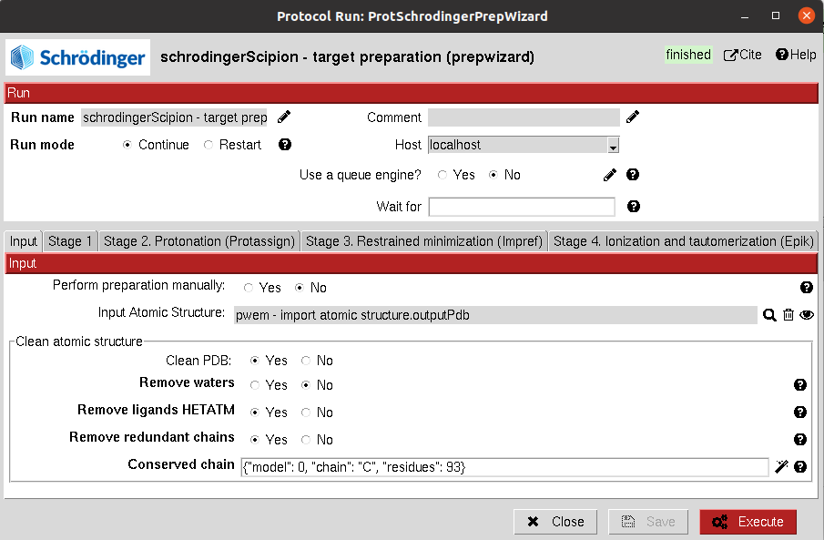
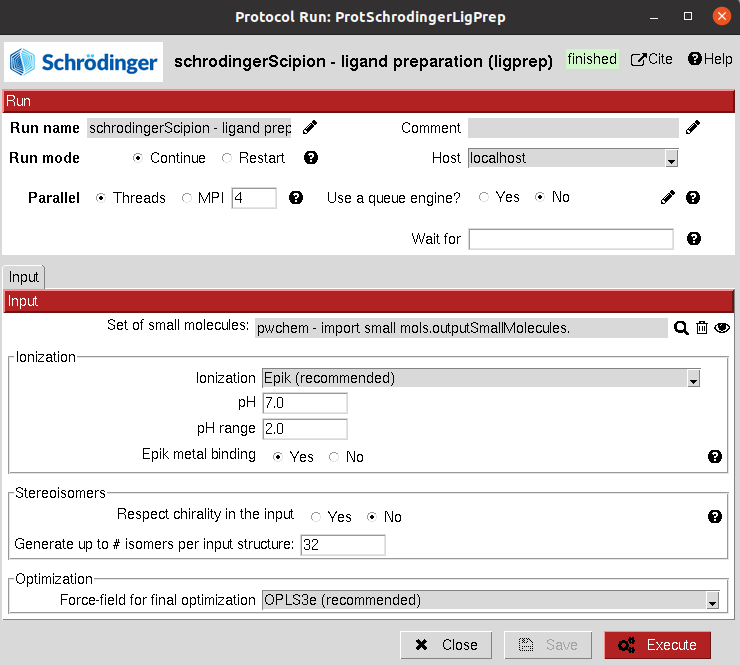
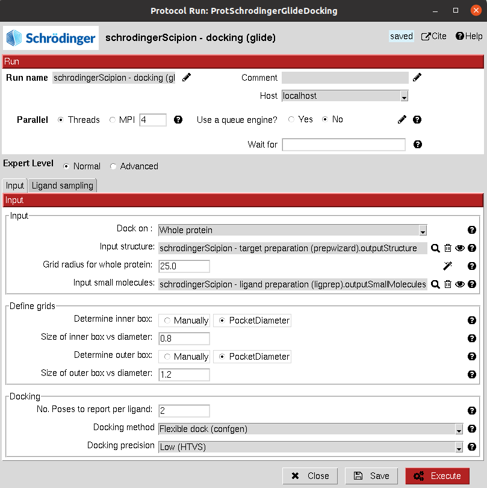
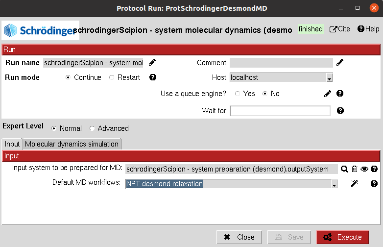
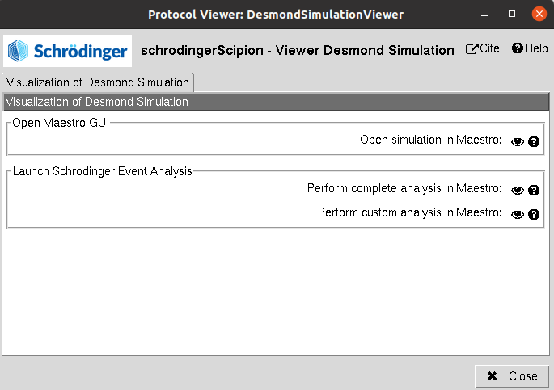
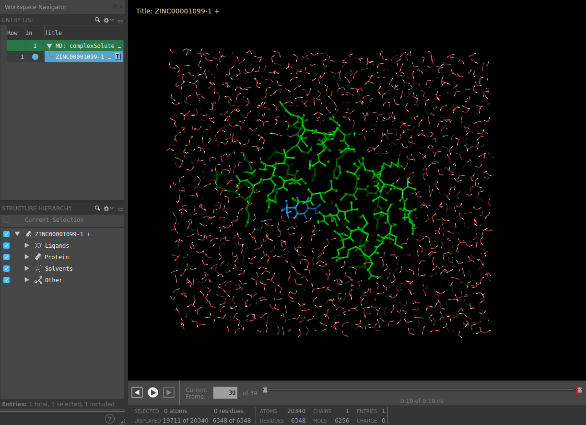
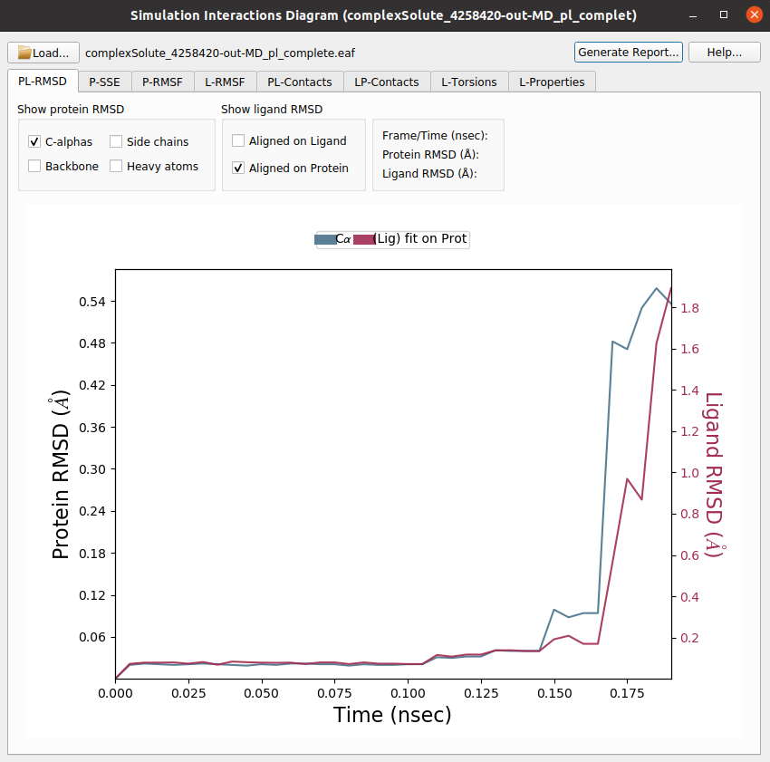

.. _docs-chem-schrodinger:

Welcome to Scipion-chem-schrodingerScipion's documentation!
=================================================
In order to use this plugin, you need to install first Scipion-chem.
`Scipion-chem <https://github.com/scipion-chem/docs>`_
is the core for the rest of scipion-chem-\* plugins. To do so, you can check the instructions in the
`Scipion-chem README <https://github.com/scipion-chem/scipion-chem/blob/master/README.rst>`_.

Similarly, you can find the installation instructions of this plugin in
`Scipion-chem-schrodingerScipion README <https://github.com/scipion-chem/scipion-chem-schrodingerScipion/blob/master/README.rst>`_

Notice that Schrodinger is a license software, so from Scipion-chem we only provide tools for using their programs, but
we do not provide the software itself, which must be separately installed by the user.

|

Scipion-chem-schrodingerScipion overview
========================================
`Schrodinger <https://www.schrodinger.com/>`_ is a platform that platform leverages a deep understanding of physics,
chemistry, and predictive modeling to accelerate innovation. It contains numerous tools for molecular modelling,
including drug discovery and molecular dynamics.

Scipion-chem-schrodingerScipion protocols
========================================

**1) Virtual Drug Screening**
-------------------------------

**Receptor preparation**
-------------------------------
This protocol prepares an AtomStruct object containing a protein file to make it ready for Schrodinger tools.
The protocol contains 4 sections with different parameters that define the receptor preparation, including protonation,
energy minimization, ionization and tautomerization. Internally, it uses the
`Prepwizard <https://www.schrodinger.com/science-articles/protein-preparation-wizard>`_ Schrodinger utility.

From Scipion-chem, we also provide the option of cleaning the structure from HETATM atoms and selecting specific
chains from the input structure.

All parameters include a help button that gives further information for each of them.

|

|

The result of this protocol is an AtomStruct object containing the resulting maestro file of the receptor, ready for
other Schrodinger tools.

A test for this protocol can be run using::
    scipion3 tests schrodingerScipion.tests.main_wf.TestSchroProtPrep

|

**Ligand preparation**
-------------------------------
This protocol prepares a SetOfSmallMolecules to make it ready for Schrodinger tools. It includes different options
for ionization, building conformers and energy optimization. Internally, it uses the
`Ligprep <https://www.schrodinger.com/products/ligprep>`_ Schrodinger program.

|

|

The result of this protocol is another SetOfSmallMolecules object this time containing the maestro files ready for
other Schrodinger tools.

|

Tests for these protocols can be run using::
    scipion3 tests schrodingerScipion.tests.main_wf.TestSchroLigPrep

|

**Binding site identification**
-------------------------------
This protocol predicts the most promising binding sites on the structure using
`SiteMap <https://www.schrodinger.com/products/sitemap>`_.

|

.. image:: ../images/schrodinger_form3.png
   :alt: schrodinger form3
   :height: 400

|

The result of this protocol is a SetOfStructROIs (Structural Regions Of Interest), containing the predicted binding
sites. The user can visualize them using **Analyze Results**, which will display the General StructROIs viewer.

Tests for these protocols can be run using::
    scipion3 tests schrodingerScipion.tests.main_wf.TestSitemap

These tests contain the tests for Receptor Preparation described above.

|

**Grid generation**
-------------------------------
This protocol generates the grids used by the docking Schrodinger program:
`Glide <https://www.schrodinger.com/products/glide>`_. The protocol is currently
deprecated since all the necessary grids are internally generated by the glide docking protocol described below.
It might just be useful to generate and then check the resulting grids.

All parameters include a help button that gives further information for each of them.

|

.. image:: ../images/schrodinger_form4.png
   :alt: schrodinger form4

|

The result of this protocol is a SetOfSchrodingerGrids, around the specified site. Each grid is conformed by an inner
grid, where the center of mass of the ligand must be docked; and an outer grid, which must contains all the atoms of
the ligand. The user can visualize these grids using **Analyze Results**.

.. figure:: ../images/schrodinger_out1_4.png
   :alt: schrodinger out1_4

A test for this protocol can be run using::
    scipion3 tests schrodingerScipion.tests.main_wf.TestGridSchro

|

**Docking**
-------------------------------
This protocol uses `Glide <https://www.schrodinger.com/products/glide>`_ for docking a set of ligands to a receptor.
The docking can be performed on the whole protein
structure or on specific sites, which can be defines as a SetOfStructROIs or as a SetOfSchrodingerGrids.

|

|form5_1| |form5_2|

.. |form5_1| image:: ../images/schrodinger_form5_1.png
   :alt: schrodinger form5_1
   :height: 490

|

The results of these protocols are a SetOfSmallMolecules, containing the predicted binding poses for the input
molecules. The user can visualize them using **Analyze Results**, which will display the General SmallMolecules viewer.

Tests for these protocols can be run using::
    scipion3 tests schrodingerScipion.tests.main_wf.TestGlideDocking

This test contain the tests for Receptor Preparation, Binding Site prediction, Grid Generation and Ligand Preparation
described above.

|

**2) Molecular dynamics**
-------------------------------

**System preparation**
-------------------------------
This protocol prepares a Schrodinger MD system using
`Desmond <https://www.schrodinger.com/products/desmond>`_ prior to its simulation from a AtomStruct or a SmallMolecule object.
We recommend you to input the protein or ligand structures from a previous Schrodinger protocol. If the structure comes
from another plugin or a raw pdb, conversions will be attempted to adapt them to the Schrodinger format.

This protocol allows the user to create a solute boundary box, define the force field and finally specify the ions in
the solute, which can be set to neutralize the charges, or manually add the desired number.

This protocol also includes the functionality for preparing complexes containing non-protein atoms,
such as ligands, as Schrodinger takes care of the ligand parametrization itself.

All parameters include a help button that gives further information for each of them.

|

|form6_1| |form6_2|

.. |form6_1| image:: ../images/schrodinger_form6_1.png
   :alt: schrodinger form6_1
   :height: 420

.. |form6_2| image:: ../images/schrodinger_form6_2.png
   :alt: schrodinger form6_2
   :height: 420

|

The result of this protocol is a SchrodingerSystem, containing the Schrodinger structural files. The user
can visualize the complex with Maestro using **Analyze Results**.

|

|out6_1| |out6_2|

.. |out6_1| image:: ../images/schrodinger_out6_1.png
   :alt: schrodinger out6_1
   :height: 425

.. |out6_2| image:: ../images/schrodinger_out6_2.png
   :alt: schrodinger out6_2
   :height: 425

|

A test for this protocol can be run using::
    scipion3 tests schrodingerScipion.tests.md_wf.TestDesmondSysPrep

|

**Run MD simulation**
-------------------------------
This protocol takes the prepared Schrodinger system and uses
`Desmond <https://www.schrodinger.com/products/desmond>`_ to run a defined simulation. In the form, the user can
define different simulation stages that the protocol will run sequentially. The parameters of this protocol are grouped
as:

1) **Input**: The SchrodingerSystem product of the system preparation described above.

Then, the user can define the different MD stages:

2) **Simulation time**: Defines the length of the simulation in number of steps for the minimization and in time for NVT and NPT. In the case of NVT and NPT, the user can also specify whether the trajectory from the stage should be saved.

3) **Trajectory**: Defines the trajectory parameters and whether it should be saved.

4) **Ensemble**: Defines the type of simulation in the current stage. The user can choose from energy minimization, NVE, NVT, NPT... Then, for each of them other parameters will appear to further tune the simulation.

5) **Restraints**: Energetic restraints can be defined during the stage for the principal groups of atoms present in the system (Ligand, Protein, Solute, Heavy atoms...)

Then, the defined stage can be inserted into the workflow, whose summary is shown below.

5) **Summary**: A summary of the added stages is shown. However, this list is just a summary and manual modifications will not yield changes. In order to modify the stages, the user need to use the wizards in order to add, delete or watch the parameters of the desired stages, which can be specified in the wizard text input.

The user can also choose from a set of default workflows that will automatically be added to the summary when its wizard is used. Currently, only the default "NPT desmond relaxation" is included, which carries out a typical system relaxation.

|

|out7_1| |out7_2|

.. |out7_2| image:: ../images/schrodinger_form7_2.png
   :alt: schrodinger form7_2
   :height: 470

|

The result of this protocol is a SchrodingerSystem, this time also containing the concatenated trajectory of the
last saved stages (If stages 2, 4 and 5 were saved, since we should not concatenate 2 to 4, only 4 and 5 will be saved).
Using **Analyze Results**, a form with different visualization options will be displayed, where the user can:

|

|

1) **Open MD simulation**: Inspect the system trajectories of the different stages saved using Maestro.
|

|

2) **Schrodinger Event Analysis**: Perform different analysis of the trajectories using Desmond. The user can choose whether to perform the complete set of analysis or a custom subset. Among these analysis it includes the variation of RMSD, RMSF, Gyration... of the different atom groups through the trajectory.

|

|out7_3| |out7_4|

.. |out7_3| image:: ../images/schrodinger_out7_3.png
   :alt: schrodinger out7_3
   :height: 470

|

A test for this protocol can be run using::
    scipion3 tests schrodingerScipion.tests.md_wf.TestDesmondMD

This test contains the test for System Preparation described above.

Get in contact
==================

From the Scipion team we would be happy to hear your doubts and suggestions, do not hesitate to contact us at any
time. To do so, you can either open an issue in the Github repository related to your question or
contact us by mail.

If the question is related to the Scipion framework, try the `contact us <https://scipion.i2pc.es/contact>`_ page.
If it is related to some Scipion-chem plugin or functionality, you can send a mail to
the developer at ddelhoyo@cnb.csic.es

