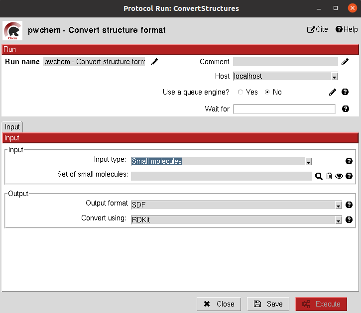
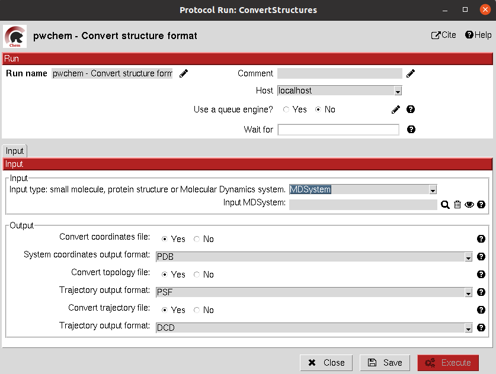
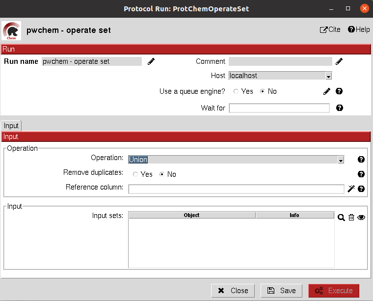
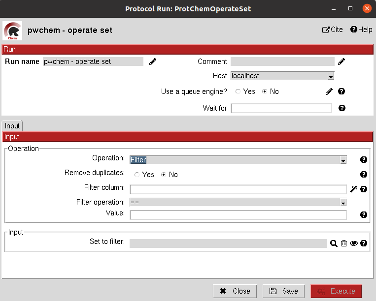
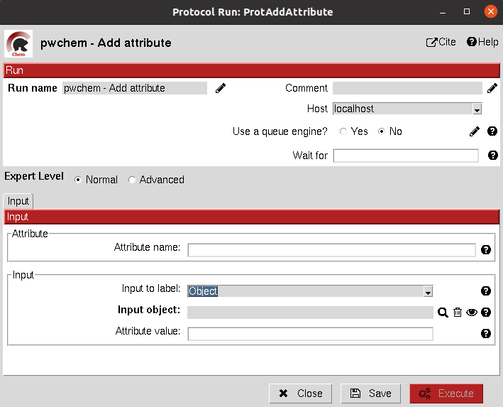
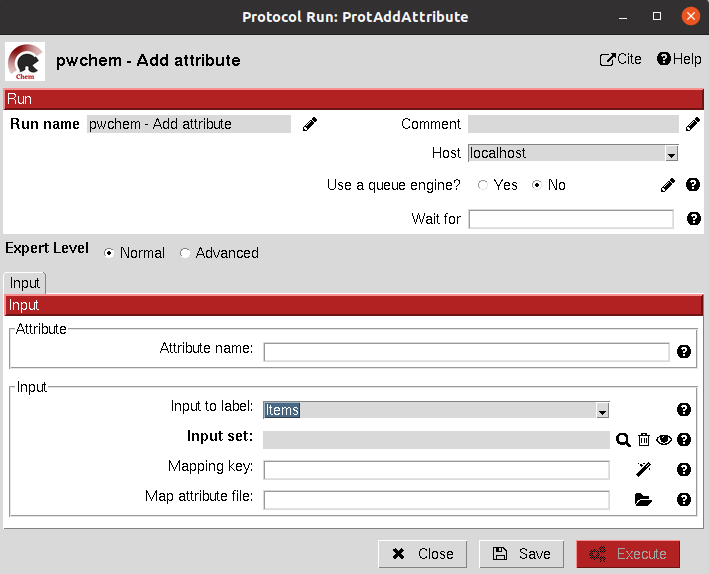
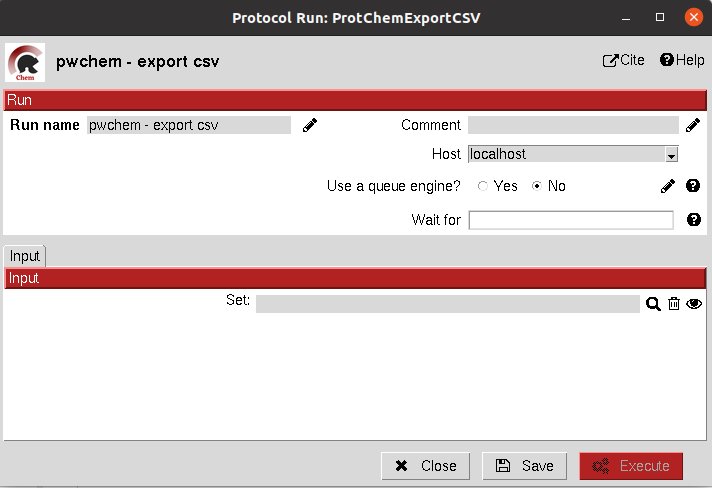

.. _docs-chem:

.. figure:: ../images/pwchem_logo.png
   :alt: pwchem logo

###############################################################
Welcome to Scipion-chem's documentation!
###############################################################
In order to use this plugin, you need to install first `Scipion-em <https://github.com/scipion-em>`_
This plugin, Scipion-chem, is the core for the rest of scipion-chem-\* plugins.

|

Scipion-chem overview
******************************************
`Scipion-chem <https://github.com/scipion-chem/scipion-chem>`_ is the core plugin for Virtual Drug Screening (VDS) in
the Scipion platform. It is designed to manage and make interoperable all the the satellite plugins
(Autodock, fpocket,...). It also includes several tools for:

- Managing small molecules, protein structures or molecular dynamics simulations.
- Consensus tools that extract the most relevant results from protein pocket search and docking.
- Visualization of the results for each of the VDS steps.
- Filter and operate the different sets obtained at each step of the workflow.

To do so, Scipion-chem automatically installs the following external software:

- **OpenBabel and RDKit**: the main small molecule handlers and converters
- **MGLTools**: additional utils for small molecules, docking, ... (includes AutoDockTools)
- **JChemPaint**: Java program to manually draw small molecules.
- **PyMol**: main viewer of Scipion-Chem for small molecules and structures
- **AliView**: main viewer for sequences
- **PLIP**: specialized viewer for docking interactions in PyMol

These programs are managed through conda environments, which also includes different util Python modules.

|

Scipion-chem protocols
******************************************
Scipion-chem includes around 40 different protocols subdivided in 4 groups of protocols according to their function:

- **General**: It includes protocols for managing the objects or files generated by Scipion.
- **Databases**: It includes protocols related to the main databases for protein sequences, structures or small molecules.
- **Sequences**: It incorporates protocols for managing biological sequences, including tools for defining sequence regions of interest.
- **VirtualDrugScreening**: main group of protocols that incorporates most of the functionalities related to the VDS workflow.

The different protocols included in these subgroups will be defined in the following sections, including also a test
for most of them.

**1) General protocols**
================================

**Convert structure**
----------------------

This protocol converts the format of the files stored for a set of Small Molecules, an Atom Structure or a Molecular
dynamics system (either coordinates, topology or trajectory files).

In order to do the conversions, we use RDKit or OpenBabel for small molecules, biopython for Atom Structures and parmed
and mdtraj for Molecular Dynamics systems.

All parameters include a help button that gives further information for each of them.

|

|form1_1| |form1_2|

|

The result of this protocol is object equal to the one in the input, but this time the files inside this object are in
the desired format.

A test for this protocol can be run using::
    scipion3 tests pwchem.tests.tests_general.TestConverter

|

**Operate set**
----------------------

This protocol includes several functionalities to modify any Scipion Set inside the project. It handles the internal
SQLite representation to modify the set object. The user must define a reference attribute of the items which will
determine the function of the protocol:

- *Unique*: keeps only one of the elements which have the referent attribute repeated.
- *Union*: merges two sets of the same type. The user can still perform the Unique operation after that.
- *Intersection*: keeps only the intersection of several sets, using the reference attribute.
- *Difference*: keeps the elements of the first set that are not repeated in the second set
- *Filter*: filters the set based on a filter attribute value and a filter operation the user can specify. Keeps only the elements that pass the filter.
- *Remove columns*: remove a column or attribute from a Set object
- *Ranking*: sorts the elements of a Set based on the filter column and keeps only those elements above/below a defined threshold.

These operations have some shared functionalities with "edit set" and "filter set" protocols from Scipion-em. The user
is free to choose among them.

All parameters include a help button that gives further information for each of them.

|

|form2_1| |form2_2|

|

The result of this protocol is a Set of the same type of the input, modified with the specified operation.

A test for this protocol can be run using::
    scipion3 tests pwchem.tests.tests_general.TestOperateSet

|

**Add attribute**
----------------------

This protocol allows the user to add an attribute to an item or set object inside Scipion. It has somehow a similar but
contrary function than the "Remove column" operation of the "Operate set" protocol, but the definition of the input can
be a bit more complex.

All parameters include a help button that gives further information for each of them.

|

|form3_1| |form3_2|

|

The result of this protocol is a Set of the same type of the input, with the added attribute.

A test for this protocol can be run using::
    scipion3 tests pwchem.tests.tests_attributes.TestAddAttribute

|

**Export csv**
----------------------

This protocol allows the user to export the SQLite table of a set as a csv file, containing the values of each attribute
for each column and each item in a row. This protocol might be useful for further exploring the attributes of a Set.

All parameters include a help button that gives further information for each of them.

|

|form4|

|

The result of this protocol is a csv file in the protocol folder. It has no Scipion output object.

A test for this protocol can be run using::
    scipion3 tests pwchem.tests.tests_general.TestExportcsv

|

Get in contact
******************************************

From the Scipion team we would be happy to hear your doubts and suggestions, do not hesitate to contact us at any
time. To do so, you can either open an issue in the Github repository related to your question or
contact us by mail.

If the question is related to the Scipion framework, try the `contact us <https://scipion.i2pc.es/contact>`_ page.
If it is related to some Scipion-chem plugin or functionality, you can send a mail to
the developer at ddelhoyo@cnb.csic.es

