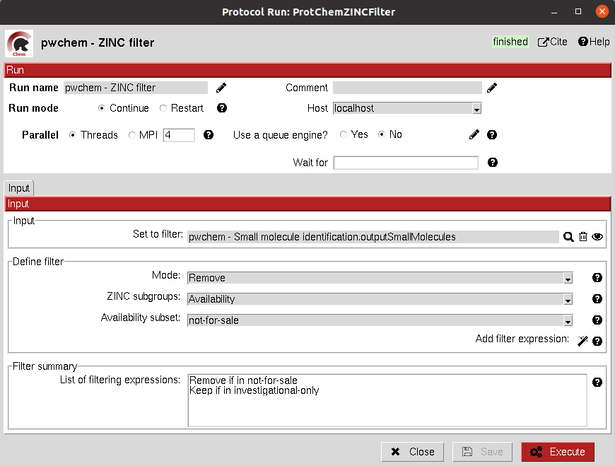
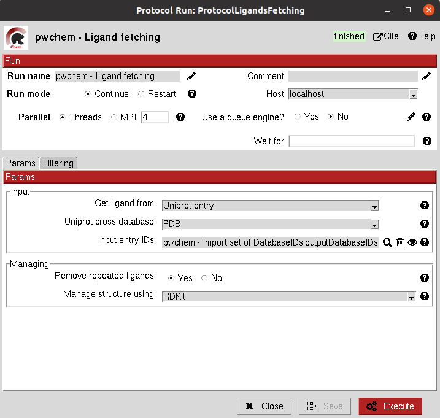
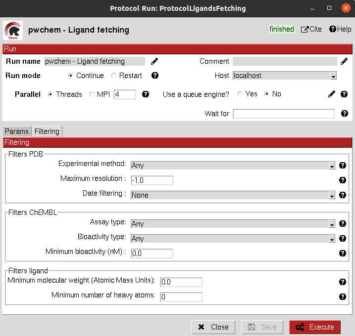
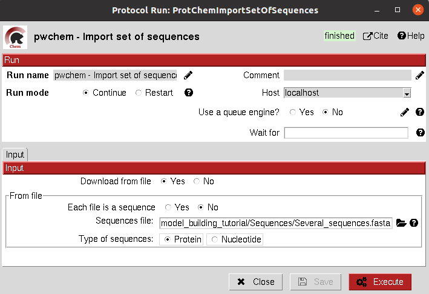

.. _docs-chem:

.. figure:: ../images/pwchem_logo.png
   :alt: pwchem logo

###############################################################
Welcome to Scipion-chem's documentation!
###############################################################
In order to use this plugin, you need to install first `Scipion-em <https://github.com/scipion-em>`_
This plugin, Scipion-chem, is the core for the rest of scipion-chem-\* plugins.

|

Scipion-chem overview
******************************************
`Scipion-chem <https://github.com/scipion-chem/scipion-chem>`_ is the core plugin for Virtual Drug Screening (VDS) in
the Scipion platform. It is designed to manage and make interoperable all the the satellite plugins
(Autodock, fpocket,...). It also includes several tools for:

- Managing small molecules, protein structures or molecular dynamics simulations.
- Consensus tools that extract the most relevant results from protein pocket search and docking.
- Visualization of the results for each of the VDS steps.
- Filter and operate the different sets obtained at each step of the workflow.

To do so, Scipion-chem automatically installs the following external software:

- **OpenBabel and RDKit**: the main small molecule handlers and converters
- **MGLTools**: additional utils for small molecules, docking, ... (includes AutoDockTools)
- **JChemPaint**: Java program to manually draw small molecules.
- **PyMol**: main viewer of Scipion-Chem for small molecules and structures
- **VMD**: secondary viewer of Scipion-Chem for structures and Molecular Dynamics
- **AliView**: main viewer for sequences
- **PLIP**: specialized viewer for docking interactions in PyMol

These programs are managed through conda environments, which also includes different util Python modules.

|

Scipion-chem protocols
******************************************
Scipion-chem includes around 40 different protocols subdivided in 4 groups of protocols according to their function:

- **A) General**: It includes protocols for managing the objects or files generated by Scipion.
- **B) Databases**: It includes protocols related to the main databases for protein sequences, structures or small molecules.
- **C) Sequences**: It incorporates protocols for managing biological sequences, including tools for defining sequence regions of interest.
- **D) VirtualDrugScreening**: main group of protocols that incorporates most of the functionalities related to the VDS workflow.

The different protocols included in these subgroups will be defined in the following sections, including also a test
for most of them.

The user will notice that many protocols have a wand icon next to some of the parameters. We call this button wizard and
they are designed to help the user to use the protocol. One of the most common types of wizard will help the user to
fill a parameter with the proper string. We strongly recommend to use the wizards to fill these parameters (for some
protocols, it is even compulsory) since inappropriate use of the parameters might lead the protocol to fail.

**A) General protocols**
================================

**A.1) Convert structure**
----------------------

This protocol converts the format of the files stored for a set of Small Molecules, an Atom Structure or a Molecular
dynamics system (either coordinates, topology or trajectory files).

In order to do the conversions, we use RDKit or OpenBabel for small molecules, biopython for Atom Structures and parmed
and mdtraj for Molecular Dynamics systems.

All parameters include a help button that gives further information for each of them.

|

|form1_1| |form1_2|

.. |form1_1| image:: ../images/pwchem_form1_1.png
   :alt: pwchem form1_1
   :height: 400

.. |form1_2| image:: ../images/pwchem_form1_2.png
   :alt: pwchem form1_2
   :height: 400

|

The result of this protocol is object equal to the one in the input, but this time the files inside this object are in
the desired format.

A test for this protocol can be run using::
    scipion3 tests pwchem.tests.tests_general.TestConverter

|

**A.2) Operate set**
----------------------

This protocol includes several functionalities to modify any Scipion Set inside the project. It handles the internal
SQLite representation to modify the set object. The user must define a reference attribute of the items which will
determine the function of the protocol:

- *Unique*: keeps only one of the elements which have the referent attribute repeated.
- *Union*: merges two sets of the same type. The user can still perform the Unique operation after that.
- *Intersection*: keeps only the intersection of several sets, using the reference attribute.
- *Difference*: keeps the elements of the first set that are not repeated in the second set
- *Filter*: filters the set based on a filter attribute value and a filter operation the user can specify. Keeps only the elements that pass the filter.
- *Remove columns*: remove a column or attribute from a Set object
- *Ranking*: sorts the elements of a Set based on the filter column and keeps only those elements above/below a defined threshold.

These operations have some shared functionalities with "edit set" and "filter set" protocols from Scipion-em. The user
is free to choose among them.

All parameters include a help button that gives further information for each of them.

|

|form2_1| |form2_2|

.. |form2_1| image:: ../images/pwchem_form2_1.png
   :alt: pwchem form2_1
   :height: 400

.. |form2_2| image:: ../images/pwchem_form2_2.png
   :alt: pwchem form2_2
   :height: 400

|

The result of this protocol is a Set of the same type of the input, modified with the specified operation.

A test for this protocol can be run using::
    scipion3 tests pwchem.tests.tests_general.TestOperateSet

|

**A.3) Add attribute**
----------------------

This protocol allows the user to add an attribute to an item or set object inside Scipion. It has somehow a similar but
contrary function than the "Remove column" operation of the "Operate set" protocol, but the definition of the input can
be a bit more complex.

All parameters include a help button that gives further information for each of them.

|

|form3_1| |form3_2|

.. |form3_1| image:: ../images/pwchem_form3_1.png
   :alt: pwchem form3_1
   :height: 390

.. |form3_2| image:: ../images/pwchem_form3_2.png
   :alt: pwchem form3_2
   :height: 390

|

The result of this protocol is a Set of the same type of the input, with the added attribute.

|

Before:

|out3_1|

After:

|out3_2|

.. |out3_2| image:: ../images/pwchem_out3_2.png
   :alt: pwchem out3_2
   :height: 150

|

A test for this protocol can be run using::
    scipion3 tests pwchem.tests.tests_attributes.TestAddAttribute

|

**A.4) Export csv**
----------------------

This protocol allows the user to export the SQLite table of a set as a csv file, containing the values of each attribute
for each column and each item in a row. This protocol might be useful for further exploring the attributes of a Set.

All parameters include a help button that gives further information for each of them.

|

|form4|

.. |form4| image:: ../images/pwchem_form4.png
   :alt: pwchem form4
   :height: 400

|

The result of this protocol is a csv file in the protocol folder. It has no Scipion output object.

|

|out4|

.. |out4| image:: ../images/pwchem_out4.png
   :alt: pwchem out4
   :height: 170

|

A test for this protocol can be run using::
    scipion3 tests pwchem.tests.tests_general.TestExportcsv

|

**B) Database protocols**
================================

**B.1) Import database IDs**
------------------------

This protocol imports a set of database IDs from a file and stores them as a Scipion object. It save the ID and the
origin database name.

All parameters include a help button that gives further information for each of them.

|

|form5|

.. |form5| image:: ../images/pwchem_form5.png
   :alt: pwchem form5
   :height: 400

|

The result of this protocol is a SetOfDatabaseIDs containing the databases that were defined in the input file.

A test for this protocol can be run using::
    scipion3 tests pwchem.tests.tests_databases.TestImportDBIDs

|

**B.2) Identify ligands**
----------------------

This protocol tries to identify a set of Small Molecules based on the SMILES string for each of them. To do so, it uses
the PubChem API (https://pubchem.ncbi.nlm.nih.gov/docs/pug-rest). If no exact match is found, it looks for similar
compounds (which are specified in a summary file) and outputs the most similar. The protocol further identifies the
small molecule by using the PuChem cross references to extract the ID from other databases (currently ZINC and ChEMBL).
All this identifiers are stored in the object, and the user can choose to switch the main molecule name by one of them.

All parameters include a help button that gives further information for each of them.

|

|form6|

.. |form6| image:: ../images/pwchem_form6.png
   :alt: pwchem form6
   :height: 400

|

The result of this protocol is a SetOfSmallMolecules which includes the found identifiers for each molecule.

|

|out6|

.. |out6| image:: ../images/pwchem_out6.png
   :alt: pwchem out10
   :height: 200

|

A test for this protocol can be run using::
    scipion3 tests pwchem.tests.tests_databases.TestIdentifyLigands

|

**B.3) UniProt CrossRef**
----------------------

This protocol searches in the UniProt cross reference database for related entries of a set of UniProt IDs for
specified databases. The user can choose whether to store the cross reference as a secondary or the main ID and
whether to store also additional properties stored in those IDs.

All parameters include a help button that gives further information for each of them.

|

|form7|

.. |form7| image:: ../images/pwchem_form7.png
   :alt: pwchem form7
   :height: 400

|

The result of this protocol is a SetOfDatabaseIDs containing the information of the cross references. This can also
be checked in a summary file.

A test for this protocol can be run using::
    scipion3 tests pwchem.tests.tests_databases.TestUniProtCrossRef

|

**B.4) ZINC filter**
----------------------

This protocol filters a SetOfSmallMolecules by the presence/absence of each of the molecules in the specified ZINC
subset(s). To do so, the molecules must have a ZINC ID, either in the MolName or in a ZINC_ID attribute
(easy to get using the Identify ligands protocol).
You can find the different defined ZINC subsets in https://zinc15.docking.org/substances/subsets/ .

All parameters include a help button that gives further information for each of them.

|

|form8|

|

The result of this protocol is a SetOfSmallMolecules where those molecules in the input that did not match the subgroup
filters have been removed.

A test for this protocol can be run using::
    scipion3 tests pwchem.tests.tests_databases.TestZINCFilter

|

**B.5) Fetch ligands**
----------------------

This protocol extracts the ligands related to a SetOfDatabaseIDs. It defines 3 levels of relation depending on the
database IDs:

- *UniProt IDs*: using their cross references with an specified database, it will relate each UniProt ID to a number of target structures and extract their ligands.
- *Target IDs*: the IDs refer to a protein target. The protocol will extract all ligands found in the structure.
- *Ligand IDs*: the IDs refer directly to the IDs of the ligands in the specified database.

In a second section, you can define several filters for the extracted ligands, from general ones according to the
ligand structure to more specific depending on the chose database.

All parameters include a help button that gives further information for each of them.

|

|form9_1| |form9_2|

|

The result of this protocol is a SetOfSmallMolecules with the extracted ligands.

A test for this protocol can be run using::
    scipion3 tests pwchem.tests.tests_databases.TestFetchLigands

|

**C) Sequence protocols**
================================

**C.1) Import SetOfSequences**
---------------------------------

This protocol imports a set of sequences from one or several fasta files or from a database like UniProt using a
SetOfDatabaseIDs as input.

All parameters include a help button that gives further information for each of them.

|

|form10_1| |form10_2|

.. |form10_2| image:: ../images/pwchem_form10_2.png
   :alt: pwchem form10_2
   :height: 330

|

The result of this protocol is a SetOfSequences with the specified sequences.

|

|out10|

.. |out10| image:: ../images/pwchem_out10.png
   :alt: pwchem out10
   :height: 200

|

A test for this protocol can be run using::
    scipion3 tests pwchem.tests.tests_imports.TestImportSequences

|

**C.2) Pairwise Alignment**
---------------------------------

This protocol perform a pairwise alignment using clustal omega over two input sequences.
These sequences can be input either from a Sequence or an AtomStruct objects, in the later,
the chain must also be specified.

All parameters include a help button that gives further information for each of them.

|

|form11|

.. |form11| image:: ../images/pwchem_form11.png
   :alt: pwchem form11
   :height: 450

|

The result of this protocol is a SetOfSequences with the two input sequences aligned.

|

|out11|

.. |out11| image:: ../images/pwchem_out11.png
   :alt: pwchem out11
   :height: 200

|

A test for this protocol can be run using::
    scipion3 tests pwchem.tests.tests_sequences.TestPairwiseAlign

|

**C.3) Multiple Sequence Alignment**
-------------------------------------

This protocol perform a multiple sequence alignment (MSA) over a set of input sequences.
The alignment can be performed using either Clustal Omega, Muscle or Mafft, which are automatically installed in the
Scipion-chem plugin. Additional parameters for each of the programs can be manually input.

All parameters include a help button that gives further information for each of them.

|

|form12|

|

The result of this protocol is a SetOfSequences with the two input sequences aligned.

|

|out12|

.. |out12| image:: ../images/pwchem_out12.png
   :alt: pwchem out12
   :height: 200

|

A test for this protocol can be run using::
    scipion3 tests pwchem.tests.tests_sequences.TestMultipleAlignSequences

|

**C.4) Define set of sequences**
-------------------------------------

This protocol allows the user to manually build a set of small molecules from individual elements, which can be either
Sequence, AtomStruct objects or even PDB codes. In the case of structures and PDB, the chain must be specified. Also,
the user can always select just a segment of the total sequence to be added.

All parameters include a help button that gives further information for each of them.

|

|form13|

.. |form13| image:: ../images/pwchem_form13.png
   :alt: pwchem form13
   :height: 450

|

The result of this protocol is a SetOfSequences with each of the defined sequences in the input.

A test for this protocol can be run using::
    scipion3 tests pwchem.tests.tests_sequences.TestDefineSetSequences

|

**C.5) Import variants**
---------------------------------

This protocol imports a set of sequence variants. These can be imported either from the natural defined in a single
UniProt ID or with a customized file defining single point mutations.

All parameters include a help button that gives further information for each of them.

|

|form14_1| |form14_2|

.. |form14_2| image:: ../images/pwchem_form14_2.png
   :alt: pwchem form14_2
   :height: 320

|

The result of this protocol is a SequenceVariants object containing the original sequence with the defined variants.

|

|out14|

.. |out14| image:: ../images/pwchem_out14.png
   :alt: pwchem out14
   :height: 400

|

A test for this protocol can be run using::
    scipion3 tests pwchem.tests.tests_imports.TestImportVariants

|

**C.6) Generate variant sequences**
-----------------------------------

This protocol generates a set of sequences from a list of specified variants from a SequenceVariants object.

All parameters include a help button that gives further information for each of them.

|

|form15|

.. |form15| image:: ../images/pwchem_form15.png
   :alt: pwchem form15
   :height: 450

|

The result of this protocol is a SetOfSequences which contains all the defined variants or single mutations from
the input.

|

|out14|

.. |out14| image:: ../images/pwchem_out14.png
   :alt: pwchem out14
   :height: 400

|

A test for this protocol can be run using::
    scipion3 tests pwchem.tests.tests_sequences.TestGenerateSequences

|

**C.7) Import Sequence ROIs**
-----------------------------------

This protocol imports a SetOfSequenceROIs, meaning a set of Regions Of Interest (ROI) in a sequence. As for today,
this protocol is oriented to epitopes defined in IEDB (https://www.iedb.org/ ). More origins of these ROIs will be
added in the future.

All parameters include a help button that gives further information for each of them.

|

|form16|

|

The result of this protocol are several SetOfSequenceROIs, one for each sequence defined in the input,
where the defined ROIs are those epitopes defined in the input.

A test for this protocol can be run using::
    scipion3 tests pwchem.tests.tests_imports.TestImportSeqROIs

|

**C.8) Define Sequence ROIs**
-----------------------------------

This protocol defines a SetOfSequenceROIs from a Sequence or SequenceVariants object. The user can define a list of
Regions Of Interest from sequence segments, variants or mutations in the input.

All parameters include a help button that gives further information for each of them.

|

|form17|

|

The result of this protocol is a SetOfSequenceROIs with the ROIs defined in the input.

A test for this protocol can be run using::
    scipion3 tests pwchem.tests.tests_sequences.TestDefineSequenceROIs

|

**C.9) Operate Sequence ROIs**
-----------------------------------

This protocol allows the user to operate sets of sequence ROIs, similarly to the operate sets. In this protocol however,
the overlap of the ROIs is the attribute taken into account for the set operations.

All parameters include a help button that gives further information for each of them.

|

|form18|

|

The result of this protocol is a SetOfSequenceROIs with the operated regions.

A test for this protocol can be run using::
    scipion3 tests pwchem.tests.tests_sequences.TestOperateSeqROIs

|

**C.10) Extract Sequence ROIs**
-----------------------------------

This protocol defines a SetOfSequenceROIs from an input set of sequences based on the conservation of each position
in the alignment. If the user provides an input structure which can be aligned to the input sequences, the regions
can also be mapped to the structure.

The conserved / variable regions are defined based on a threshold. The user can preview the conservation values of
the alignment in order to tune this threshold.

At some point in the future, the user will be able to extract sequence ROIs from other attributes than conservation.

All parameters include a help button that gives further information for each of them.

|

|form19|

.. |form19| image:: ../images/pwchem_form19.png
   :alt: pwchem form19
   :height: 550

|

The result of this protocol is a SetOfSequenceROIs with the regions whose the conservation values or over / below the
threshold set. If the input structure is provided, an AtomStruct object is also output. Using analyze results,
the user can visualize the conservation values over the structure.

A test for this protocol can be run using::
    scipion3 tests pwchem.tests.tests_sequences.TestExtractSequenceROIs

|

**C.11) Map Sequence ROIs**
-----------------------------------

This protocol maps a set of sequence ROIs to an atomic structure where the sequence can be mapped. The alignment of the
sequence that contains the ROIs and the one coming from the structure can be previewed. Then, those residues defined as
sequence ROIs are mapped to the surface of the structure and those surface regions next to each other are clustered
to build structural ROIs.

All parameters include a help button that gives further information for each of them.

|

|form20|

.. |form20| image:: ../images/pwchem_form20.png
   :alt: pwchem form20
   :height: 500

|

The result of this protocol is a SetOfStructROIs with the mapped sequence ROIs over the input structure.

A test for this protocol can be run using::
    scipion3 tests pwchem.tests.tests_sequences.TestMapSeqROIs

|

Get in contact
******************************************

From the Scipion team we would be happy to hear your doubts and suggestions, do not hesitate to contact us at any
time. To do so, you can either open an issue in the Github repository related to your question or
contact us by mail.

If the question is related to the Scipion framework, try the `contact us <https://scipion.i2pc.es/contact>`_ page.
If it is related to some Scipion-chem plugin or functionality, you can send a mail to
the developer at ddelhoyo@cnb.csic.es

