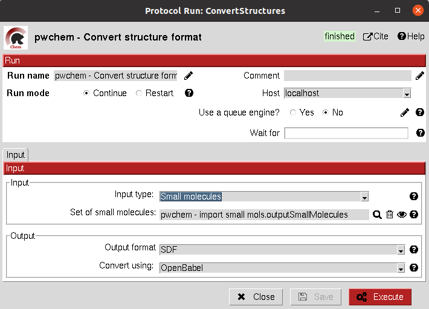
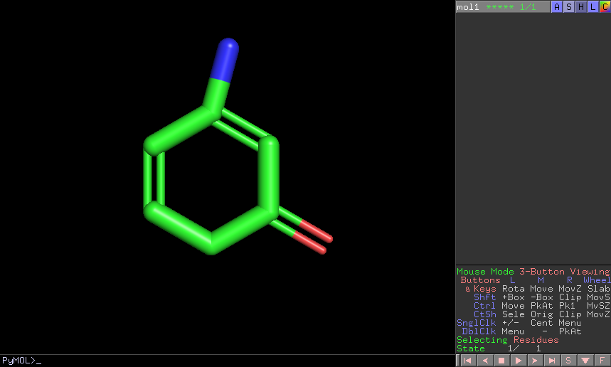
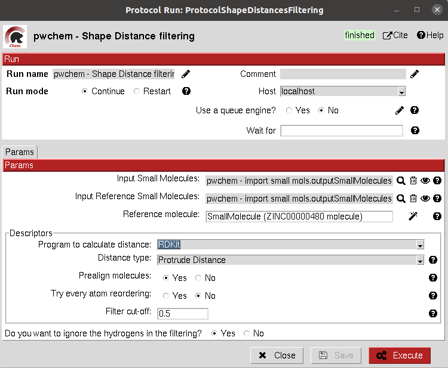
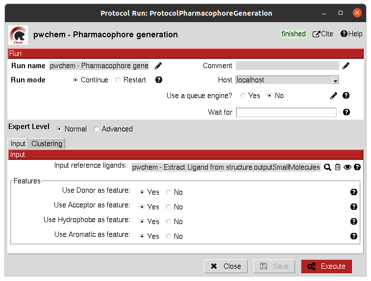
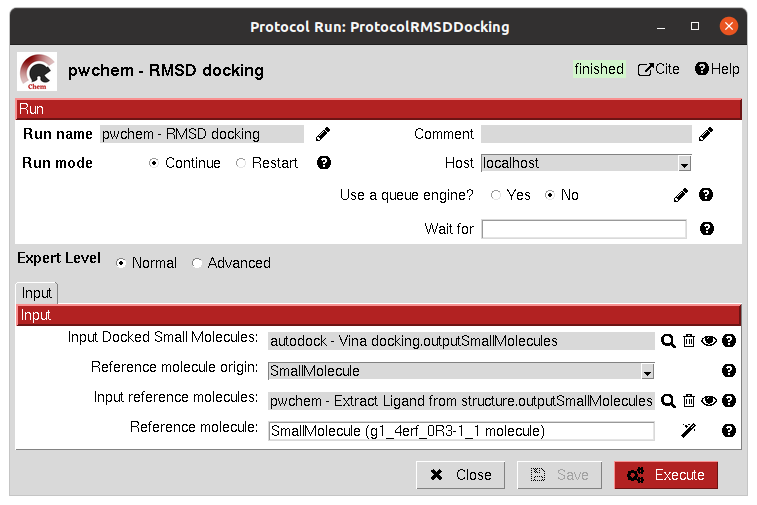
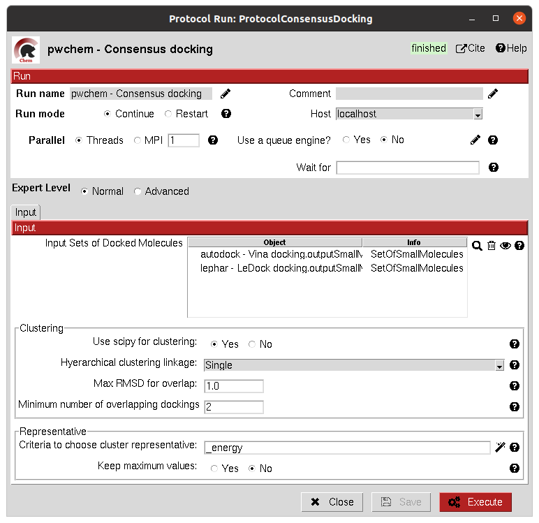
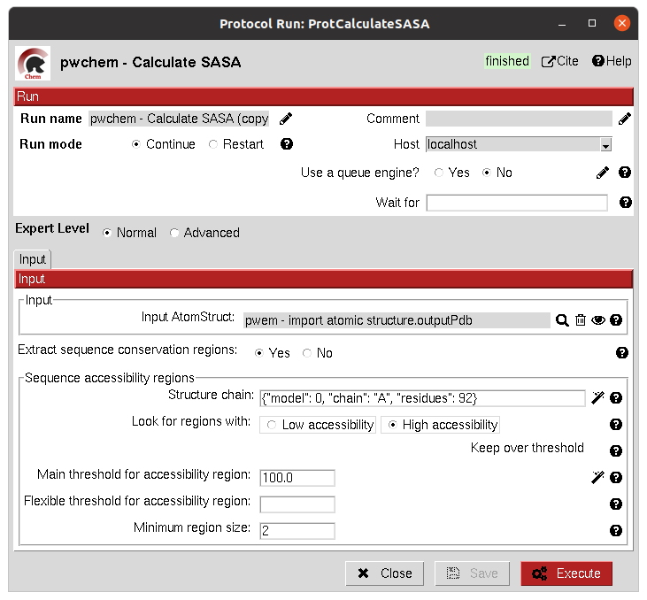
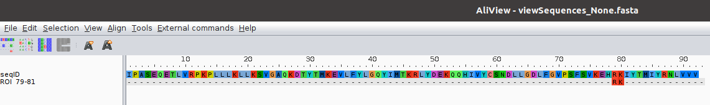

.. _docs-chem:

.. figure:: ../images/pwchem_logo.png
   :alt: pwchem logo

###############################################################
Welcome to Scipion-chem's documentation!
###############################################################
In order to use this plugin, you need to install first `Scipion-em <https://github.com/scipion-em>`_
This plugin, Scipion-chem, is the core for the rest of scipion-chem-\* plugins.

|

Scipion-chem overview
******************************************
`Scipion-chem <https://github.com/scipion-chem/scipion-chem>`_ is the core plugin for Virtual Drug Screening (VDS) in
the Scipion platform. It is designed to manage and make interoperable all the the satellite plugins
(Autodock, fpocket,...). It also includes several tools for:

- Managing small molecules, protein structures or molecular dynamics simulations.
- Consensus tools that extract the most relevant results from protein pocket search and docking.
- Visualization of the results for each of the VDS steps.
- Filter and operate the different sets obtained at each step of the workflow.

To do so, Scipion-chem automatically installs the following external software:

- **OpenBabel and RDKit**: the main small molecule handlers and converters
- **MGLTools**: additional utils for small molecules, docking, ... (includes AutoDockTools)
- **JChemPaint**: Java program to manually draw small molecules.
- **PyMol**: main viewer of Scipion-Chem for small molecules and structures
- **VMD**: secondary viewer of Scipion-Chem for structures and Molecular Dynamics
- **AliView**: main viewer for sequences
- **PLIP**: specialized viewer for docking interactions in PyMol

These programs are managed through conda environments, which also includes different util Python modules.

|

Scipion-chem protocols
******************************************
Scipion-chem includes around 40 different protocols subdivided in 4 groups of protocols according to their function:

- **A) General**: It includes protocols for managing the objects or files generated by Scipion.
- **B) Databases**: It includes protocols related to the main databases for protein sequences, structures or small molecules.
- **C) Sequences**: It incorporates protocols for managing biological sequences, including tools for defining sequence regions of interest.
- **D) VirtualDrugScreening**: main group of protocols that incorporates most of the functionalities related to the VDS workflow.

The different protocols included in these subgroups will be defined in the following sections, including also a test
for most of them.

The user will notice that many protocols have a wand icon next to some of the parameters. We call this button wizard and
they are designed to help the user to use the protocol. One of the most common types of wizard will help the user to
fill a parameter with the proper string. We strongly recommend to use the wizards to fill these parameters (for some
protocols, it is even compulsory) since inappropriate use of the parameters might lead the protocol to fail.

**A) General protocols**
================================

**A.1) Convert structure**
----------------------

This protocol converts the format of the files stored for a set of Small Molecules, an Atom Structure or a Molecular
dynamics system (either coordinates, topology or trajectory files).

In order to do the conversions, we use RDKit or OpenBabel for small molecules, biopython for Atom Structures and parmed
and mdtraj for Molecular Dynamics systems.

All parameters include a help button that gives further information for each of them.

|

|formA1_1| |formA1_2|

.. |formA1_2| image:: ../images/pwchem_formA1_2.png
   :alt: pwchem formA1_2
   :height: 400

|

The result of this protocol is object equal to the one in the input, but this time the files inside this object are in
the desired format.

|

A test for this protocol can be run using::
    scipion3 tests pwchem.tests.tests_general.TestConverter

|

**A.2) Operate set**
----------------------

This protocol includes several functionalities to modify any Scipion Set inside the project. It handles the internal
SQLite representation to modify the set object. The user must define a reference attribute of the items which will
determine the function of the protocol:

- *Unique*: keeps only one of the elements which have the referent attribute repeated.
- *Union*: merges two sets of the same type. The user can still perform the Unique operation after that.
- *Intersection*: keeps only the intersection of several sets, using the reference attribute.
- *Difference*: keeps the elements of the first set that are not repeated in the second set
- *Filter*: filters the set based on a filter attribute value and a filter operation the user can specify. Keeps only the elements that pass the filter.
- *Remove columns*: remove a column or attribute from a Set object
- *Ranking*: sorts the elements of a Set based on the filter column and keeps only those elements above/below a defined threshold.

These operations have some shared functionalities with "edit set" and "filter set" protocols from Scipion-em. The user
is free to choose among them.

All parameters include a help button that gives further information for each of them.

|

|formA2_1| |formA2_2|

.. |formA2_2| image:: ../images/pwchem_formA2_2.png
   :alt: pwchem formA2_2
   :height: 400

|

The result of this protocol is a Set of the same type of the input, modified with the specified operation.

|

A test for this protocol can be run using::
    scipion3 tests pwchem.tests.tests_general.TestOperateSet

|

**A.3) Add attribute**
----------------------

This protocol allows the user to add an attribute to an item or set object inside Scipion. It has somehow a similar but
contrary function than the "Remove column" operation of the "Operate set" protocol, but the definition of the input can
be a bit more complex.

All parameters include a help button that gives further information for each of them.

|

|formA3_1| |formA3_2|

.. |formA3_2| image:: ../images/pwchem_formA3_2.png
   :alt: pwchem formA3_2
   :height: 390

|

The result of this protocol is a Set of the same type of the input, with the added attribute.

|

Before:

|outA3_1|

After:

|outA3_2|

.. |outA3_1| image:: ../images/pwchem_outA3_1.png
   :alt: pwchem Aout3_1
   :height: 150

|

A test for this protocol can be run using::
    scipion3 tests pwchem.tests.tests_attributes.TestAddAttribute

|

**A.4) Export csv**
----------------------

This protocol allows the user to export the SQLite table of a set as a csv file, containing the values of each attribute
for each column and each item in a row. This protocol might be useful for further exploring the attributes of a Set.

All parameters include a help button that gives further information for each of them.

|

|formA4|

|

The result of this protocol is a csv file in the protocol folder. It has no Scipion output object.

|

|outA4|

.. |outA4| image:: ../images/pwchem_outA4.png
   :alt: pwchem Aout4
   :height: 170

|

A test for this protocol can be run using::
    scipion3 tests pwchem.tests.tests_general.TestExportcsv

|

**B) Database protocols**
================================

**B.1) Import database IDs**
------------------------

This protocol imports a set of database IDs from a file and stores them as a Scipion object. It save the ID and the
origin database name.

All parameters include a help button that gives further information for each of them.

|

|formB1|

|

The result of this protocol is a SetOfDatabaseIDs containing the databases that were defined in the input file.

|

A test for this protocol can be run using::
    scipion3 tests pwchem.tests.tests_databases.TestImportDBIDs

|

**B.2) Identify ligands**
----------------------

This protocol tries to identify a set of Small Molecules based on the SMILES string for each of them. To do so, it uses
the PubChem API (https://pubchem.ncbi.nlm.nih.gov/docs/pug-rest). If no exact match is found, it looks for similar
compounds (which are specified in a summary file) and outputs the most similar. The protocol further identifies the
small molecule by using the PuChem cross references to extract the ID from other databases (currently ZINC and ChEMBL).
All this identifiers are stored in the object, and the user can choose to switch the main molecule name by one of them.

All parameters include a help button that gives further information for each of them.

|

|formB2|

|

The result of this protocol is a SetOfSmallMolecules which includes the found identifiers for each molecule.

|

|outB2|

|

A test for this protocol can be run using::
    scipion3 tests pwchem.tests.tests_databases.TestIdentifyLigands

|

**B.3) UniProt CrossRef**
----------------------

This protocol searches in the UniProt cross reference database for related entries of a set of UniProt IDs for
specified databases. The user can choose whether to store the cross reference as a secondary or the main ID and
whether to store also additional properties stored in those IDs.

All parameters include a help button that gives further information for each of them.

|

|formB3|

|

The result of this protocol is a SetOfDatabaseIDs containing the information of the cross references. This can also
be checked in a summary file.

|

A test for this protocol can be run using::
    scipion3 tests pwchem.tests.tests_databases.TestUniProtCrossRef

|

**B.4) ZINC filter**
----------------------

This protocol filters a SetOfSmallMolecules by the presence/absence of each of the molecules in the specified ZINC
subset(s). To do so, the molecules must have a ZINC ID, either in the MolName or in a ZINC_ID attribute
(easy to get using the Identify ligands protocol).
You can find the different defined ZINC subsets in https://zinc15.docking.org/substances/subsets/ .

All parameters include a help button that gives further information for each of them.

|

|formB4|

.. |formB4| image:: ../images/pwchem_formB4.png
   :alt: pwchem formB4
   :height: 500

|

The result of this protocol is a SetOfSmallMolecules where those molecules in the input that did not match the subgroup
filters have been removed.

|

A test for this protocol can be run using::
    scipion3 tests pwchem.tests.tests_databases.TestZINCFilter

|

**B.5) Fetch ligands**
----------------------

This protocol extracts the ligands related to a SetOfDatabaseIDs. It defines 3 levels of relation depending on the
database IDs:

- *UniProt IDs*: using their cross references with an specified database, it will relate each UniProt ID to a number of target structures and extract their ligands.
- *Target IDs*: the IDs refer to a protein target. The protocol will extract all ligands found in the structure.
- *Ligand IDs*: the IDs refer directly to the IDs of the ligands in the specified database.

In a second section, you can define several filters for the extracted ligands, from general ones according to the
ligand structure to more specific depending on the chose database.

All parameters include a help button that gives further information for each of them.

|

|formB5_1| |formB5_2|

.. |formB5_1| image:: ../images/pwchem_formB5_1.png
   :alt: pwchem formB5_1
   :height: 450

.. |formB5_2| image:: ../images/pwchem_formB5_2.png
   :alt: pwchem formB5_2
   :height: 450

|

The result of this protocol is a SetOfSmallMolecules with the extracted ligands.

|

A test for this protocol can be run using::
    scipion3 tests pwchem.tests.tests_databases.TestFetchLigands

|

**C) Sequence protocols**
================================

**C.1) Import SetOfSequences**
---------------------------------

This protocol imports a set of sequences from one or several fasta files or from a database like UniProt using a
SetOfDatabaseIDs as input.

All parameters include a help button that gives further information for each of them.

|

|formC1_1| |formC1_2|

.. |formC1_1| image:: ../images/pwchem_formC1_1.png
   :alt: pwchem formC1_1
   :height: 330

.. |formC1_2| image:: ../images/pwchem_formC1_2.png
   :alt: pwchem formC1_2
   :height: 330

|

The result of this protocol is a SetOfSequences with the specified sequences.

|

|outC1|

.. |outC1| image:: ../images/pwchem_outC1.png
   :alt: pwchem outC1
   :height: 150

|

A test for this protocol can be run using::
    scipion3 tests pwchem.tests.tests_imports.TestImportSequences

|

**C.2) Pairwise Alignment**
---------------------------------

This protocol perform a pairwise alignment using clustal omega over two input sequences.
These sequences can be input either from a Sequence or an AtomStruct objects, in the later,
the chain must also be specified.

All parameters include a help button that gives further information for each of them.

|

|formC2|

.. |formC2| image:: ../images/pwchem_formC2.png
   :alt: pwchem formC2
   :height: 450

|

The result of this protocol is a SetOfSequences with the two input sequences aligned.

|

|outC2|

|

A test for this protocol can be run using::
    scipion3 tests pwchem.tests.tests_sequences.TestPairwiseAlign

|

**C.3) Multiple Sequence Alignment**
-------------------------------------

This protocol perform a multiple sequence alignment (MSA) over a set of input sequences.
The alignment can be performed using either Clustal Omega, Muscle or Mafft, which are automatically installed in the
Scipion-chem plugin. Additional parameters for each of the programs can be manually input.

All parameters include a help button that gives further information for each of them.

|

|formC3|

.. |formC3| image:: ../images/pwchem_formC3.png
   :alt: pwchem formC3
   :height: 500

|

The result of this protocol is a SetOfSequences with the two input sequences aligned.

|

|outC3|

|

A test for this protocol can be run using::
    scipion3 tests pwchem.tests.tests_sequences.TestMultipleAlignSequences

|

**C.4) Define set of sequences**
-------------------------------------

This protocol allows the user to manually build a set of small molecules from individual elements, which can be either
Sequence, AtomStruct objects or even PDB codes. In the case of structures and PDB, the chain must be specified. Also,
the user can always select just a segment of the total sequence to be added.

All parameters include a help button that gives further information for each of them.

|

|formC4|

|

The result of this protocol is a SetOfSequences with each of the defined sequences in the input.

|

A test for this protocol can be run using::
    scipion3 tests pwchem.tests.tests_sequences.TestDefineSetSequences

|

**C.5) Import variants**
---------------------------------

This protocol imports a set of sequence variants. These can be imported either from the natural defined in a single
UniProt ID or with a customized file defining single point mutations.

All parameters include a help button that gives further information for each of them.

|

|formC5_1| |formC5_2|

.. |formC5_1| image:: ../images/pwchem_formC5_1.png
   :alt: pwchem formC5_1
   :height: 320

.. |formC5_2| image:: ../images/pwchem_formC5_2.png
   :alt: pwchem formC5_2
   :height: 320

|

The result of this protocol is a SequenceVariants object containing the original sequence with the defined variants.

|

|outC5|

|

A test for this protocol can be run using::
    scipion3 tests pwchem.tests.tests_imports.TestImportVariants

|

**C.6) Generate variant sequences**
-----------------------------------

This protocol generates a set of sequences from a list of specified variants from a SequenceVariants object.

All parameters include a help button that gives further information for each of them.

|

|formC6|

.. |formC6| image:: ../images/pwchem_formC6.png
   :alt: pwchem formC6
   :height: 450

|

The result of this protocol is a SetOfSequences which contains all the defined variants or single mutations from
the input.

|

|outC6|

.. |outC6| image:: ../images/pwchem_outC6.png
   :alt: pwchem outC6
   :height: 200

|

A test for this protocol can be run using::
    scipion3 tests pwchem.tests.tests_sequences.TestGenerateSequences

|

**C.7) Import Sequence ROIs**
-----------------------------------

This protocol imports a SetOfSequenceROIs, meaning a set of Regions Of Interest (ROI) in a sequence. As for today,
this protocol is oriented to epitopes defined in IEDB (https://www.iedb.org/ ). More origins of these ROIs will be
added in the future.

All parameters include a help button that gives further information for each of them.

|

|formC7|

.. |formC7| image:: ../images/pwchem_formC7.png
   :alt: pwchem formC7
   :height: 400

|

The result of this protocol are several SetOfSequenceROIs, one for each sequence defined in the input,
where the defined ROIs are those epitopes defined in the input.

|

A test for this protocol can be run using::
    scipion3 tests pwchem.tests.tests_imports.TestImportSeqROIs

|

**C.8) Define Sequence ROIs**
-----------------------------------

This protocol defines a SetOfSequenceROIs from a Sequence or SequenceVariants object. The user can define a list of
Regions Of Interest from sequence segments, variants or mutations in the input.

All parameters include a help button that gives further information for each of them.

|

|formC8|

.. |formC8| image:: ../images/pwchem_formC8.png
   :alt: pwchem formC8
   :height: 500

|

The result of this protocol is a SetOfSequenceROIs with the ROIs defined in the input.

|

|outC8|

|

A test for this protocol can be run using::
    scipion3 tests pwchem.tests.tests_sequences.TestDefineSequenceROIs

|

**C.9) Operate Sequence ROIs**
-----------------------------------

This protocol allows the user to operate sets of sequence ROIs, similarly to the operate sets. In this protocol however,
the overlap of the ROIs is the attribute taken into account for the set operations.

All parameters include a help button that gives further information for each of them.

|

|formC9|

.. |formC9| image:: ../images/pwchem_formC9.png
   :alt: pwchem formC9
   :height: 450

|

The result of this protocol is a SetOfSequenceROIs with the operated regions.

|

A test for this protocol can be run using::
    scipion3 tests pwchem.tests.tests_sequences.TestOperateSeqROIs

|

**C.10) Extract Sequence ROIs**
-----------------------------------

This protocol defines a SetOfSequenceROIs from an input set of sequences based on the conservation of each position
in the alignment. If the user provides an input structure which can be aligned to the input sequences, the regions
can also be mapped to the structure.

The conserved / variable regions are defined based on a threshold. The user can preview the conservation values of
the alignment in order to tune this threshold.

|

|outC10|

|

At some point in the future, the user will be able to extract sequence ROIs from other attributes than conservation.

All parameters include a help button that gives further information for each of them.

|

|formC10|

.. |formC10| image:: ../images/pwchem_formC10.png
   :alt: pwchem formC10
   :height: 550

|

The result of this protocol is a SetOfSequenceROIs with the regions whose the conservation values or over / below the
threshold set. If the input structure is provided, an AtomStruct object is also output. Using analyze results,
the user can visualize the conservation values over the structure.

|

A test for this protocol can be run using::
    scipion3 tests pwchem.tests.tests_sequences.TestExtractSequenceROIs

|

**C.11) Map Sequence ROIs**
-----------------------------------

This protocol maps a set of sequence ROIs to an atomic structure where the sequence can be mapped. The alignment of the
sequence that contains the ROIs and the one coming from the structure can be previewed. Then, those residues defined as
sequence ROIs are mapped to the surface of the structure and those surface regions next to each other are clustered
to build structural ROIs.

All parameters include a help button that gives further information for each of them.

|

|formC11|

.. |formC11| image:: ../images/pwchem_formC11.png
   :alt: pwchem formC11
   :height: 500

|

The result of this protocol is a SetOfStructROIs with the mapped sequence ROIs over the input structure.

|

|outC11|

|

A test for this protocol can be run using::
    scipion3 tests pwchem.tests.tests_sequences.TestMapSeqROIs

|

**D) Virtual Drug Screening protocols**
================================

**D.1) Import Small Molecules**
---------------------------------

This protocol imports a set of small molecules from one or several files or from default database libraries like ECBL
or ZINC.

All parameters include a help button that gives further information for each of them.

|

|formD1_1| |formD1_2|

.. |formD1_2| image:: ../images/pwchem_formD1_2.png
   :alt: pwchem formD1_2
   :height: 400

|

The result of this protocol is a SetOfSmallMolecules, in 2D or 3D conformations depending on the source and whether
the user specified 3D optimization.

|

|outD1|

.. |outD1| image:: ../images/pwchem_outD1.png
   :alt: pwchem outD1
   :height: 400

|

A test for this protocol can be run using::
    scipion3 tests pwchem.tests.tests_imports.TestImportSmallMolecules

|

**D.2) Extract Small Molecules**
---------------------------------

This protocol extract the small molecules present in a AtomStruct object.

All parameters include a help button that gives further information for each of them.

|

|formD2|

.. |formD2| image:: ../images/pwchem_formD2.png
   :alt: pwchem formD2
   :height: 400

|

The result of this protocol is a SetOfSmallMolecules, docked to the original protein structure, which can be
cleaned.

|

|outD2|

.. |outD2| image:: ../images/pwchem_outD2.png
   :alt: pwchem outD2
   :height: 400

|

A test for this protocol can be run using::
    scipion3 tests pwchem.tests.tests_docking.TestExtractLigand

|

**D.3) Draw Small Molecules**
---------------------------------

This protocol runs JChemPaint java program and allows the user to draw their own molecules.

All parameters include a help button that gives further information for each of them.

|

|formD3_1| |formD3_2|

.. |formD3_1| image:: ../images/pwchem_formD3_1.png
   :alt: pwchem formD3_1
   :height: 400

.. |formD3_2| image:: ../images/pwchem_formD3_2.png
   :alt: pwchem formD3_2
   :height: 400

|

If the molecules are saved in the protocol folder and mol (default) format, Scipion3 will automatically detect the files
and generate a SetOfSmallMolecules as output. If the molecules are saved somewhere else, the user will have to import
them.

|

|outD3|

|

**D.4) OpenBabel Prepare Small Molecules**
---------------------------------

This protocol prepares a SetOfSmallMolecules using OpenBabel. The user can choose several methods for the charge
assignment and conformer generation.

All parameters include a help button that gives further information for each of them.

|

|formD4|

.. |formD4| image:: ../images/pwchem_formD4.png
   :alt: pwchem formD4
   :height: 400

|

The result of this protocol is a SetOfSmallMolecules prepared by OpenBabel. If the option for generating conformers
was chosen, different conformations for each input molecule will be accessible.

|

|outD4|

.. |outD4| image:: ../images/pwchem_outD4.png
   :alt: pwchem outD4
   :height: 400

|

A test for this protocol can be run using::
    scipion3 tests pwchem.tests.tests_preparations.TestOBLigandPreparation

|

**D.5) RDKit Prepare Small Molecules**
---------------------------------

This protocol prepares a SetOfSmallMolecules using RDKit. The user can choose several methods for the charge
assignment and conformer generation.

All parameters include a help button that gives further information for each of them.

|

|formD5|

.. |formD5| image:: ../images/pwchem_formD5.png
   :alt: pwchem formD5
   :height: 400

|

The result of this protocol is a SetOfSmallMolecules prepared by RDKit. If the option for generating conformers
was chosen, different conformations for each input molecule will be accessible.

|

|outD5|

|

A test for this protocol can be run using::
    scipion3 tests pwchem.tests.tests_preparations.TestRDKitLigandPreparation

|

**D.6) Prepare Receptor**
---------------------------------

This protocol provides a simple AtomStruct preparation with BioPython where the user can choose different cleaning
options like removing waters, heteroatoms, keep only specific chains... Its functionality is included in several other
protocols that manage AtomStruct objects.

All parameters include a help button that gives further information for each of them.

|

|formD6|

.. |formD6| image:: ../images/pwchem_formD6.png
   :alt: pwchem formD6
   :height: 400

|

The result of this protocol is an AtomStruct cleaned with the form specifications.

|

|outD6|

.. |outD6| image:: ../images/pwchem_outD6.png
   :alt: pwchem outD6
   :height: 400

|

A test for this protocol can be run using::
    scipion3 tests pwchem.tests.tests_preparations.TestPrepareReceptor

|

**D.7) ADME Small Molecules filter**
------------------------------------

This protocol uses RDKit to filter a SetOfSmallMolecules by applying the ADME (Absortion, Distribution,
Metabolism, Excretion) filter to each of the small molecules stored. The user can choose whether to use the Lipinski's
rule of five or the Rule of three (https://en.wikipedia.org/wiki/Lipinski%27s_rule_of_five ).

All parameters include a help button that gives further information for each of them.

|

|formD7|

|

The result of this protocol is a SetOfSmallMolecules containing only those small molecules that pass the filter.

|

A test for this protocol can be run using::
    scipion3 tests pwchem.tests.tests_ligand_filtering.TestADMEFiltering

|

**D.8) PAINS Small Molecules filter**
---------------------------------------

This protocol uses RDKit to filter a SetOfSmallMolecules by applying the PAINS (Pan-assay interference compounds)
filter (https://en.wikipedia.org/wiki/Pan-assay_interference_compounds ) to each of the small molecules stored.
The user can choose whether to use RDKit default PAINS substructures or to provide a custom PAINS file where each line
must contain a first column with a SMARTS string and a second column with a short description.

All parameters include a help button that gives further information for each of them.

|

|formD8|

|

The result of this protocol is a SetOfSmallMolecules containing only those small molecules that pass the filter.

|

A test for this protocol can be run using::
    scipion3 tests pwchem.tests.tests_ligand_filtering.TestPAINSFiltering

|

**D.9) Shape Small Molecules filter**
---------------------------------------

This protocol uses RDKit to filter a SetOfSmallMolecules by applying shape filters to each of the small molecules
stored. The user can choose whether to use RDKit or Shape-it (currently not automatically installed) to calculate the
molecules shape and different shape distance options like Tanimoto, Protrude or RMSD distances.

Other parameters include the prealignment of the molecules or to trying atom reordering in order to improve the filter
performance.

Currently, `Shape-it <https://github.com/rdkit/shape-it>`_ is not automatically installed with Scipion-chem.
If the user wants to use it, they must install it manually and define its path in the scipion.conf file as SHAPEIT_HOME.

All parameters include a help button that gives further information for each of them.

|

|formD9|

|

The result of this protocol is a SetOfSmallMolecules containing only those small molecules that pass the filter.

|

A test for this protocol can be run using::
    scipion3 tests pwchem.tests.tests_ligand_filtering.TestShapeFiltering

|

**D.10) FingerPrint Small Molecules filter**
---------------------------------------------

This protocol uses RDKit to filter a SetOfSmallMolecules by applying fingerprint filters to each of the small molecules
stored. The user can choose whether to use Morgan or MACCS fingerprints and whether to use Tanimoto or Dice
similarity coefficients.

All parameters include a help button that gives further information for each of them.

|

|formD10|

|

The result of this protocol is a SetOfSmallMolecules containing only those small molecules that pass the filter.

A test for this protocol can be run using::
    scipion3 tests pwchem.tests.tests_ligand_filtering.TestFingerprintFiltering

|

**D.11) Pharmacophore generation**
-----------------------------------

This protocol generate a Pharmacophore object that can be parse by RDKit from a SetOfSmallMolecules. If the input
molecules are docked to a structure, the output pharmacophore keeps that structure too. The different features that
can be captured by the pharmacophore are defined in the BaseFeatures.def file of RDKit. Scipion-chem uses the
families of those features as own features (Donor, Acceptor, Hydrophobe, Aromatic...).

Different cluster parameters can be chosen to generate the pharmacophore, they control the clustering method and how
conserved the feature must be among the docked small molecules.

All parameters include a help button that gives further information for each of them.

|

|formD11_1| |formD11_2|

|

The result of this protocol is a PharmacophoreChem object containing the extracted features from the set of small molecules
with the specified clustering parameters.

|

|outD11|

.. |outD11| image:: ../images/pwchem_outD11.png
   :alt: pwchem outD11
   :height: 400

|

A test for this protocol can be run using::
    scipion3 tests pwchem.tests.tests_pharmacophores.TestPharmGeneration

|

**D.12) Pharmacophore modification**
---------------------------------------------

This protocol modifies the properties of the features inside a Pharmacophore object. The user can design a list of
actions involving removal or modification of present features or the addition of new ones. The user can specify the
coordinates, size and type  of each of the modified features.

All parameters include a help button that gives further information for each of them.

|

|formD12|

.. |formD12| image:: ../images/pwchem_formD12.png
   :alt: pwchem formD12
   :height: 400

|

The result of this protocol is a PharmacophoreChem object with the modified features.

|

|outD12|

.. |outD12| image:: ../images/pwchem_outD12.png
   :alt: pwchem outD12
   :height: 400

|

A test for this protocol can be run using::
    scipion3 tests pwchem.tests.tests_pharmacophores.TestPharmModification

|

**D.13) Pharmacophore filtering**
---------------------------------------------

This protocol uses RDKit for filtering a SetOfSmallMolecules by matching them with a Pharmacophore.
For each molecule to pass, its own features must match those of the pharmacophore with a certain maximum deviation.
Several different molecule-pharmacophore alignments can be tried to match them.

All parameters include a help button that gives further information for each of them.

|

|formD13|

.. |formD13| image:: ../images/pwchem_formD13.png
   :alt: pwchem formD13
   :height: 400

|

The result of this protocol is a SetOfSmallMolecules containing only those small molecules that match the Pharmacophore.
In case the Pharmacophore included a receptor structure, the output molecules will be docked to it.
In Analyze results, the user can visualize how the molecules and the pharmacophore match.

|

|outD13|

.. |outD13| image:: ../images/pwchem_outD13.png
   :alt: pwchem outD13
   :height: 400

|

A test for this protocol can be run using::
    scipion3 tests pwchem.tests.tests_pharmacophores.TestPharmFiltering

|

**D.14) Define Structural ROIs**
---------------------------------------------

This protocol allows the user to manually define a SetOfStructROIs from AtomStruct objects. The user can define this
structural ROIs in different ways:

- **Coordinates**: directly specify the coordinates of the ROI over the structure
- **Residues**: specify those residues in the protein structure that are ROIs
- **Ligands**: existing ligands in the input structure or external (from another input) small molecules docked to the same structure
- **Protein-Protein Interfaces**: specify the interface of a pair of chains in the structure
- **Near Residues**: specify a pattern of residues that have to exist nearby

The list of input ROI definitions are mapped to actual coordinates, which can optionally be mapped to the protein
surface. These resulting points are clustered to yield the final structural ROIs.

All parameters include a help button that gives further information for each of them.

|

|formD14|

.. |formD14| image:: ../images/pwchem_formD14.png
   :alt: pwchem formD14
   :height: 600

|

The result of this protocol is a SetOfStructROIs containing those regions listed in the form.

|

|outD14|

.. |outD14| image:: ../images/pwchem_outD14.png
   :alt: pwchem outD14
   :height: 400

|

A test for this protocol can be run using::
    scipion3 tests pwchem.tests.tests_structROIs.TestDefineStructROIs

|

**D.15) Consensus Structural ROIs**
---------------------------------------------

This protocol performs a consensus operation over several SetOfStructROIs, studying which of them are shared among all
or a subset of the input sets. The protocol can be used for example to extract the most relevant and robust results
from different methods that predict protein pockets, or to extract which pockets predicted by a certain software overlap
with some interesting regions defined manually.

The protocol works by clustering the structural ROIs from the different inputs and filtering those that are not repeated
sufficiently among the inputs. For a pair of structural ROIs to be considered overlapping, they must share a certain
proportion of their involved residues.

All parameters include a help button that gives further information for each of them.

|

|formD15|

.. |formD15| image:: ../images/pwchem_formD15.png
   :alt: pwchem formD15
   :height: 400

|

The result of this protocol is a SetOfStructROIs containing the consensus structural ROIs.

|

A test for this protocol can be run using::
    scipion3 tests pwchem.tests.tests_structROIs.TestConsensusStructROIs

|

**D.16) Score docking positions**
---------------------------------------------

This protocol allows the user to rescore a SetOfSmallMolecules docked to a receptor using several
`ODDT <https://github.com/oddt/oddt>`_ scoring functions. The user may even use several of these functions together
and average them, checking first if they correlate.

All parameters include a help button that gives further information for each of them.

|

|formD16|

.. |formD16| image:: ../images/pwchem_formD16.png
   :alt: pwchem formD16
   :height: 500

|

The result of this protocol is a SetOfSmallMolecules with the calculated ODDT score.

|

A test for this protocol can be run using::
    scipion3 tests pwchem.tests.tests_docking.TestScoreDocking

|

**D.17) RMSD docking**
---------------------------------------------

This protocol allows the user to calculate the RMSD between a SetOfSmallMolecules to a reference molecule docked to the
same receptor. The reference molecule can come either from a AtomStruct or a SetOfSmallMolecules.

All parameters include a help button that gives further information for each of them.

|

|formD17_1| |formD17_2|

.. |formD17_1| image:: ../images/pwchem_formD17_1.png
   :alt: pwchem formD17_1
   :height: 350

|

The result of this protocol is a SetOfSmallMolecules with the calculated RMSD to the reference molecule.

|

A test for this protocol can be run using::
    scipion3 tests pwchem.tests.tests_docking.TestRMSDDocking

|

**D.18) Consensus docking**
---------------------------------------------

This protocol performs a consensus operation over several docked SetOfSmallMolecules, studying which positions are
shared among all or a subset of the input sets. Similarly to the Consensus structural ROIs protocol, it might be used
to obtain the most robust results, this time out of different docking protocols.

The clustering of the positions is performed based on their RMSD and different options can be chosen. The default option
will use scipy package for the clustering, allowing parallelization and using an optimized code. However, due to the
quadratic nature of the problem, this might be too computationally expensive, so we offer another option where the
clusters are formed calculating only the distance to each cluster representative. This representative is the molecule
of the cluster that has the smallest energy or biggest score. The clustering using this method is not as robust and will
depend on the molecules order, but the problem will no longer be quadratic. Choose your best option wisely.

All parameters include a help button that gives further information for each of them.

|

|formD18_1|

|

The result of this protocol is a SetOfSmallMolecules with the consensus docking positions.

|

A test for this protocol can be run using::
    scipion3 tests pwchem.tests.tests_docking.TestConsensusDocking

|

**D.19) SASA calculation**
---------------------------------------------

This protocol uses BioPython to calculate the SASA (Solvent-Accessible Surface Area) for each residue in an AtomStruct.

All parameters include a help button that gives further information for each of them.

|

|formD19_1| |formD19_2|

.. |formD19_2| image:: ../images/pwchem_formD19_2.png
   :alt: pwchem formD19_2
   :height: 425

|

The result of this protocol is an AtomStruct containing the SASA value for each reside of the receptor, which can be
visualized in the Analyzed results.

|

|outD19_1|

.. |outD19_1| image:: ../images/pwchem_outD19_1.png
   :alt: pwchem outD19_1
   :height: 500

|

Additionally, the protocol can also output a SetOfSequenceROIs with those residues with SASA values higher/lower than a
threshold. The user can preview the SASA values in the protocol to define the threshold.

|

|outD19_2|

|

A test for this protocol can be run using::
    scipion3 tests pwchem.tests.tests_attributes.TestCalculateSASA

|

Get in contact
******************************************

From the Scipion team we would be happy to hear your doubts and suggestions, do not hesitate to contact us at any
time. To do so, you can either open an issue in the Github repository related to your question or
contact us by mail.

If the question is related to the Scipion framework, try the `contact us <https://scipion.i2pc.es/contact>`_ page.
If it is related to some Scipion-chem plugin or functionality, you can send a mail to
the developer at ddelhoyo@cnb.csic.es

